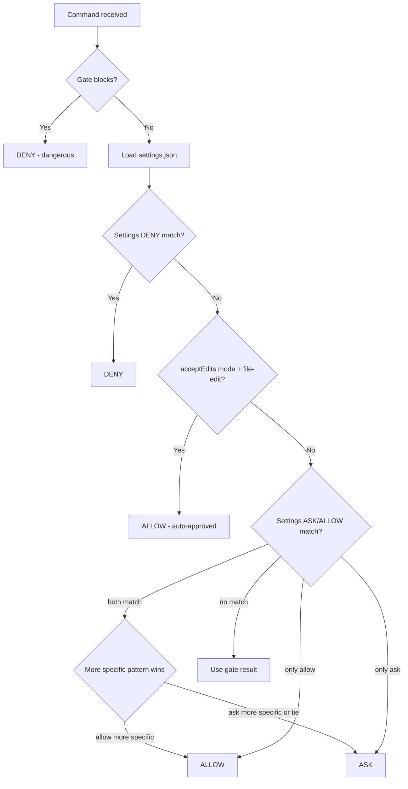

# Tool Gates (formerly `bash-gates`) - AI Coding Assistant Permission Hook (Rust)

Intelligent tool permission gate using tree-sitter AST parsing. Handles Bash/Monitor commands, Read/Write/Edit file operations, Glob/Grep searches, and MCP tools. Auto-allows known safe operations, asks for writes and unknown commands, blocks dangerous patterns.

**Claude Code:** Use as PreToolUse + PermissionRequest + PermissionDenied + PostToolUse hooks (native integration)
**Codex CLI:** Use as PreToolUse + PermissionRequest + PostToolUse hooks. Selected via the explicit `--client codex` flag baked into the installed hook command (Codex emits the same `hook_event_name` strings as Claude).
**Antigravity CLI (`agy`):** Use as a single PreToolUse hook. Selected via the explicit `--client antigravity` flag baked into the installed hook command (Antigravity sends no `hook_event_name` and uses a distinct payload shape).
**Gemini CLI (deprecated):** Use as BeforeTool + AfterTool hooks (requires v0.36.0+ for `ask` decision support). Google sunsets the consumer Gemini CLI on 2026-06-18; use Antigravity for new setups.

## Quick Reference

```bash
cargo test                              # Full test suite
cargo test gates::git -- --nocapture    # Single gate with output
cargo test test_git_status_allows       # Single test
cargo build --release                   # Release binary in target/release
cargo build --release --target x86_64-unknown-linux-musl  # Static Linux musl binary
cargo clippy -- -D warnings             # Lint

# Manual test
echo '{"tool_name": "Bash", "tool_input": {"command": "git status"}}' | tool-gates
```

## Hook Types

tool-gates supports Claude Code, Codex CLI, and Antigravity CLI hook systems, plus the deprecated Gemini CLI:

**Claude Code** (tool_name: `Bash`, `Monitor`):

| Hook | Purpose | When it runs |
|------|---------|--------------|
| **PreToolUse** | Route all tool types (Bash/Monitor, file ops, Glob/Grep, MCP, Skill), block dangerous operations, allow safe ones, provide hints, auto-approve skills, track "ask" decisions | Before any permission check |
| **PermissionRequest** | Approve safe commands and worktree edits for subagents | After internal checks decide to "ask" |
| **PermissionDenied** | Re-check classifier-denied commands; emit `retry: true` when tool-gates would have allowed | After auto-mode classifier denies a tool call |
| **PostToolUse** | Detect successful execution, add to pending approval queue | After command completes |

**Gemini CLI** (tool names: `run_shell_command`, `read_file`, `write_file`, `replace`, `glob`, `grep_search`, `activate_skill`, `mcp_*`):

| Hook | Purpose | When it runs |
|------|---------|--------------|
| **BeforeTool** | Route all tool types (shell, file ops, glob/grep, MCP, skills), block dangerous operations, allow safe ones, provide hints, file guards, security reminders | Before tool execution |
| **AfterTool** | Installed for post-execution context; write-tool security scanning currently skips Gemini until Gemini-shaped post output is implemented | After command completes |

**Codex CLI** (tool_name: `Bash`, `apply_patch`, `mcp__*`):

| Hook | Purpose | When it runs |
|------|---------|--------------|
| **PreToolUse** | Route Bash/apply_patch/MCP, block dangerous operations, pass through unknown commands to Codex's approval flow | Before any permission check |
| **PermissionRequest** | Allow/deny Bash/apply_patch only (Codex rejects `addDirectories`, `updatedInput`, `updatedPermissions`, `interrupt`) | When Codex would prompt for approval |
| **PostToolUse** | Tracking + Tier-2 security reminders; modern-CLI hints + Tier-3 warnings ride here for Codex (a tool-gates routing choice; Codex accepts `additionalContext` on PreToolUse) | After command completes |

**Antigravity CLI** (`agy`) (tool names: `run_command`, `view_file`, `write_to_file`, `replace_file_content`, `multi_replace_file_content`, `grep_search`, `find_by_name`):

| Hook | Purpose | When it runs |
|------|---------|--------------|
| **PreToolUse** | Route all tool types, block dangerous operations, allow safe ones, file guards, secret scanning. The whole gate runs here | Before tool execution |

Antigravity also exposes `PostToolUse`, `PreInvocation`, `PostInvocation`, and `Stop`, but its post payload carries no tool name or input and it has no PermissionRequest event, so tool-gates installs only PreToolUse. Its `hooks.json` is a top-level object keyed by hook name (`{"tool-gates": {"PreToolUse": [...]}}`), not the flat `{event: [...]}` shape the other clients use. `main()` normalizes the Antigravity payload (`toolCall.name` + PascalCase args) into the canonical `HookInput` shape before the engine runs.

The client is auto-detected from `hook_event_name` for Claude/Gemini. **Codex and Antigravity must be selected via the explicit `--client codex` / `--client antigravity` CLI flag** (the installer bakes it into the hook command): Codex emits the same `hook_event_name` strings as Claude, and Antigravity emits none. Output is serialized in the appropriate wire format:
- Claude: nested `hookSpecificOutput` with `permissionDecision` (`allow`/`ask`/`deny`)
- Codex: empty stdout for Allow/Ask (pass-through to Codex; prompting depends on `approval_policy` and execpolicy), nested `hookSpecificOutput.permissionDecision: "deny"` for hard blocks. `updatedInput`, `addDirectories`, `interrupt`, `continue: false`, `stopReason`, `suppressOutput`, and PreToolUse `allow`/`ask` are all rejected by Codex's parser, so tool-gates only emits the fields Codex honors.
- Antigravity: flat `{decision, reason}` where `decision` is `allow`/`ask`/`deny`/`force_ask` (the hard-ask floor uses `force_ask`). "No opinion" emits empty stdout so Antigravity's own fine-grained permission engine decides; tool-gates never auto-allows an unrecognized command. (`decision` is required by the schema; emitting none relies on the currently-undocumented behavior that Antigravity then defers to its own engine.) The Pre output has no `additionalContext` field, so hints/Tier-3 are dropped and deny remediation folds into the reason. Prompt suppression still depends on Antigravity's native permission engine.
- Gemini (deprecated): flat `decision` + `reason` (tool-gates emits `"block"` for hard blocks; Gemini also accepts `"deny"`, and exit code 2 blocks)

**Tool name mapping** (canonical names per client):

| Claude | Codex | Antigravity (`agy`) | Gemini (deprecated) | Category |
|--------|-------|---------------------|---------------------|----------|
| `Bash`, `Monitor` | `Bash` | `run_command` | `run_shell_command` | Shell commands |
| `Read` | (no read hook) | `view_file` | `read_file`, `read_many_files` | File read |
| `Write` | `apply_patch` (matcher aliases: `Write`, `Edit`) | `write_to_file` | `write_file` | File write |
| `Edit` | `apply_patch` (single payload carries the whole patch) | `replace_file_content`, `multi_replace_file_content` | `replace` | File edit |
| `Glob` | (no glob hook) | `find_by_name` | `glob` | File search |
| `Grep` | (no grep hook) | `grep_search` | `grep_search` | Text search |
| `Skill` | (n/a) | (slash commands, no tool) | `activate_skill` | Skills/extensions |
| `mcp__server__tool` | `mcp__server__tool` | (not wired yet) | `mcp_server_tool` | MCP tools |

Codex `apply_patch` payloads put the unified-diff body in `tool_input.command`. tool-gates parses out the `*** Add File: <path>` / `*** Update File: <path>` / `*** Delete File: <path>` headers (and any `*** Move to: <path>` rename targets) so file_guards and security_reminders run against every affected path.

**Why four hooks for Claude?**
- PreToolUse handles command safety for the main session and tracks commands that return "ask"
- PermissionRequest makes those same decisions work for subagents (where PreToolUse's `allow` is ignored), and auto-approves Edit/Write in agent worktrees
- PermissionDenied fires when the auto-mode classifier denies a command. If tool-gates would allow the same command, emits `retry: true` so the model can try again
- PostToolUse detects when "ask" commands complete successfully and queues them for permanent approval

**Codex limitations** (parser rejects the listed fields, so we drop them silently):
- Modern-CLI hints + Tier-3 warnings ride PostToolUse for Codex, not PreToolUse. This is a tool-gates routing choice, not a parser limitation: Codex accepts `additionalContext` on PreToolUse (upstream #20692). The Pre handler returns empty stdout on a non-deny decision (since `allow`/`ask` are rejected), so a hint riding an allow has no Pre output to attach to today
- PreToolUse `permissionDecision: "allow"` and `"ask"` are marked invalid -> tool-gates emits empty stdout for those decisions and hands them back to Codex's approval flow; prompting depends on `approval_policy` and execpolicy
- PermissionRequest `addDirectories` / `updatedInput` / `updatedPermissions` / `interrupt` are rejected -> worktree approval reduces to a flat `behavior: allow` without path expansion
- PostToolUse `updatedMCPToolOutput` is rejected -> hook output is stripped to prevent validation failure
- Codex currently emits `permission_mode` as `default` or `bypassPermissions`, not `acceptEdits`, so `[[accept_edits_mcp]]` rules are inactive for Codex MCP calls
- No PermissionDenied event in Codex (no auto-mode classifier)

**Antigravity notes** (`agy`):
- Selected via `--client antigravity` (or `--client agy`). The payload nests the tool under `toolCall.name` with PascalCase args (command at `toolCall.args.CommandLine`, write target at `toolCall.args.TargetFile`). `normalize_antigravity_pre_tool_use` in `main.rs` rewrites it into the canonical `HookInput` shape (`command`/`file_path`/`content` keys) before the engine runs; the original args are preserved alongside.
- Single PreToolUse hook: no PermissionRequest event, and the Post payload has no tool name/input, so there is nothing to track or scan after the fact. A payload without `toolCall` (a Post/Stop event) is a no-op.
- Flat `{decision, reason}` output. `Approve` (no opinion) emits empty stdout so Antigravity's own permission engine decides. `Defer` collapses to `ask` (no resolver-suggestion path). Hard blocks emit `deny`; remediation context is folded into the reason.
- `hooks.json` is keyed by hook name; the installer owns the `tool-gates` entry and leaves any other named hooks untouched. The shared user/global hook path `~/.gemini/config/hooks.json` is the recommended/default install target. Project hooks live at `.agents/hooks.json` and are available with `-s project`. Plugin-packaged hooks are a future distribution path, not required for hook installs.
- The hard-ask safety floor (pipe-to-shell, eval, dangerous substitution) maps to `force_ask`, not `ask`: Antigravity's plain `ask` honors a prior "Always Allow" grant, which would let a granted command bypass the floor, while `force_ask` always prompts. `permissionOverrides` is part of the schema but tool-gates does not emit it. MCP is not wired for Antigravity yet (its MCP tool-name format for hook matchers is undocumented).

## Project Structure

```
├── CLAUDE.md        # Agent + project instructions
├── build.rs         # Code generation: rules/*.toml -> src/generated/
├── Cargo.toml
├── .claude-plugin/  # Marketplace catalog (root-level pointer)
│   └── marketplace.json  # Points to claude-plugin/ subdirectory
├── claude-plugin/   # Plugin package (cached separately by Claude Code)
│   ├── .claude-plugin/plugin.json  # Plugin manifest
│   ├── README.md                   # Plugin documentation
│   └── skills/                     # Plugin skills (review, test-gate)
│       ├── review/SKILL.md
│       └── test-gate/SKILL.md
├── rules/           # Declarative gate definitions (13 TOML files)
│   ├── basics.toml, tool_gates.toml, beads.toml, cloud.toml, devtools.toml, runtimes.toml, ...
├── tests/fixtures/  # Test fixtures
├── tests/config_fixtures/  # Config TOML test fixtures
├── lefthook.yml     # Git hooks
└── mise.toml        # Mise task runner config
```

## Architecture

```
src/
├── main.rs              # Entry point - reads stdin JSON, outputs decision, CLI commands
├── lib.rs               # Library root
├── models.rs            # Serde models (HookInput, HookOutput, Decision)
├── parser.rs            # tree-sitter-bash AST parsing -> Vec<CommandInfo>
├── router.rs            # Raw string security checks + gate routing + task expansion
├── security_reminders.rs # Content scanning for security anti-patterns (Write/Edit)
├── settings.rs          # settings.json parsing and pattern matching
├── hints.rs             # Modern CLI hints (cat->bat, grep->rg, etc.)
├── hint_tracker.rs      # Session-scoped dedup for hints + security warnings (disk-backed)
├── tool_cache.rs        # Tool availability cache for hints
├── mise.rs              # Mise task file parsing and command extraction
├── package_json.rs      # package.json script parsing and command extraction
├── tracking.rs          # PreToolUse->PostToolUse correlation (24h TTL)
├── pending.rs           # Pending approval queue (JSONL format)
├── patterns.rs          # Pattern suggestion algorithm
├── post_tool_use.rs     # PostToolUse handler
├── permission_request.rs # PermissionRequest hook handler (subagent + worktree approval)
├── settings_writer.rs   # Write rules to Claude settings files
├── config.rs            # User configuration (~/.config/tool-gates/config.toml)
├── file_guards.rs       # Symlink guard for AI config files (Read/Write/Edit)
├── tool_blocks.rs       # Configurable tool blocking (Glob, Grep, MCP tools)
├── git_aliases.rs       # Resolve user-defined git aliases against ~/.gitconfig
├── generated/           # Auto-generated by build.rs (DO NOT EDIT)
│   ├── mod.rs           # Module declarations
│   └── rules.rs         # Rust gate functions from rules/*.toml
├── tui/                 # Interactive review TUI (full-width command list + detail, project-switcher overlay)
│   ├── mod.rs           # Module exports
│   ├── app.rs           # State machine: panels, navigation, risk-gated approve/skip/deny, confirm + undo
│   ├── theme.rs         # Semantic style tokens, decision/risk symbols, blast-radius scoring (Reset-relative, dual-theme)
│   └── ui.rs            # ratatui rendering: command list, detail panel, blast-radius meter, switcher popup
└── gates/               # 13 specialized permission gates
    ├── mod.rs           # Gate registry (ordered: mcp first, basics last)
    ├── helpers.rs       # Common gate helper functions (flag extraction, etc.)
    ├── test_utils.rs    # Test utilities (cfg(test) only)
    ├── tool_gates.rs    # tool-gates CLI itself (read-only: allow, mutations: ask)
    ├── basics.rs        # Safe shell commands (echo, cat, ls, grep, etc.)
    ├── beads.rs         # Beads issue tracker CLI (bd)
    ├── mcp.rs           # MCP CLI (mcp-cli)
    ├── gh.rs            # GitHub CLI
    ├── git.rs           # Git commands
    ├── shortcut.rs      # Shortcut.com CLI (short)
    ├── cloud.rs         # AWS, gcloud, terraform, kubectl, docker, helm, pulumi, az
    ├── network.rs       # curl, wget, ssh, scp, sftp, rsync, netcat, httpie, nmap, socat, telnet
    ├── filesystem.rs    # rm, rmdir, mv, cp, mkdir, chmod, chown, ln, tar, zip
    ├── devtools.rs      # sd, awk (safe-idiom allow / exec-write ask), ast-grep, semgrep, biome, prettier, eslint, ruff, pytest, mypy, playwright, cypress, tsx, webpack
    ├── package_managers.rs  # npm, pnpm, yarn, pip, uv, cargo, rustc, rustup, go, bun, conda, poetry, pipx, mise
    ├── runtimes.rs      # python3, node, ruby, deno, php, lua, java, dotnet, swift, elixir
    └── system.rs        # psql, mysql, make, sudo, systemctl, kill, crontab, openssl, gpg, ssh-keygen
```

### Build Pipeline

`build.rs` reads `rules/*.toml` and generates:
- `src/generated/rules.rs`, Rust functions implementing declarative gate logic

`tool-gates rules export --format md --out docs/src` regenerates `docs/src/gates/*.md`, `docs/src/security-floor.md`, and `docs/src/hints.md` from the same `rules/*.toml` plus the hint catalog, separate from `build.rs`'s `src/generated/` Rust output.

Most gate behavior is defined in TOML; custom handlers in Rust cover cases TOML can't express.

## How It Works

### PreToolUse Flow

1. **Input**: JSON from PreToolUse (Claude/Codex), BeforeTool (Gemini), or a normalized Antigravity PreToolUse payload (includes `tool_name`, `cwd`, `permission_mode`, `tool_use_id`, and `effort` in newer versions)
2. **Load config**: Read user configuration from `~/.config/tool-gates/config.toml`
3. **Configurable block rules**: Check `[[block_tools]]` rules against all tool types. Blocks matching tools with a deny message
4. **Route by tool_name**:
   - **Bash/Monitor** -> Bash gate engine (steps 5-13 below)
   - **Read/Write/Edit** -> File guards (symlink detection for AI config files), then scratch auto-allow for write targets under `$TOOL_GATES_SCRATCH` (see Scratch Directory)
   - **Glob/Grep** -> Handled by block rules in step 3; pass through if not blocked
   - **MCP tools** -> If `permission_mode == "acceptEdits"`, consult `[[accept_edits_mcp]]` rules and auto-allow on match; otherwise pass through to `permissions.allow`
   - **Skill** -> Auto-approve based on `[[auto_approve_skills]]` config rules
   - **Other tools** -> Pass through (no opinion)

#### Bash Gate Engine

5. **Mise expansion**: If command is `mise run <task>` or `mise <task>`, expand to underlying commands
6. **Package.json expansion**: If command is `npm run <script>`, `pnpm run <script>`, etc., expand to underlying command
7. **Gate analysis**: Security checks (raw string patterns) + tree-sitter parsing + gate checks; strictest decision wins
8. **If blocked**: Deny immediately (dangerous commands always blocked, regardless of settings)
9. **Load settings**: Merge settings.json from all locations
10. **Settings deny**: If command matches deny rules, deny immediately
11. **Accept Edits Mode**: If `permission_mode` is `acceptEdits` and command is file-editing within allowed directories, auto-allow
12. **Settings ask/allow**: Check remaining settings.json rules
13. **Hints**: For allowed commands, check if modern alternatives exist and add to `additionalContext`
14. **Track "ask" decisions**: If returning "ask", track command with `tool_use_id` for PostToolUse correlation
15. **Output**: JSON with `permissionDecision` (allow/ask/deny) and optional `additionalContext` (hints + approval instructions)

### PermissionRequest Flow

Runs when Claude Code's internal checks decide to show a permission prompt. Critical for **subagents**, where PreToolUse's `allow` is ignored.

**For Edit/Write tools (worktree approval):**
1. Extract and resolve `file_path` from tool input (clean `..` components)
2. Check if `cwd` is under a `.claude/worktrees/` directory (agent worktree context)
3. Check file is within the worktree cwd and not a guarded AI config file
4. If both hold -> return `allow` with `addDirectories` for the worktree cwd
5. Otherwise -> return nothing (let normal prompt show)

**For Bash tools (command approval):**
1. Re-check the command with our gates (same logic as PreToolUse)
2. If allowed by gates -> return `allow` with optional `updatedPermissions` to add blocked path to session
3. If blocked by gates -> return `deny` with reason
4. If ask by gates -> return nothing (let normal prompt show)

Input fields: `tool_input`, `decision_reason` (optional), `blocked_path` (optional), `agent_id` (present for subagents).

### PostToolUse Flow

Runs after a command completes. Detects successful execution and queues for permanent approval.

1. Check if `tool_use_id` was tracked as an "ask" decision from PreToolUse
2. If tracked and exit code is 0 -> append to `~/.cache/tool-gates/pending.jsonl`
3. Tracking-only successes are silent. File-write security reminders and Codex modern-CLI hints/Tier-3 warnings can emit `additionalContext`.

## Decision Priority

```
BLOCK > ASK > ALLOW > SKIP
```

| Decision | Output | Effect |
|----------|--------|--------|
| `block` | `permissionDecision: "deny"` | Block with reason |
| `ask` | `permissionDecision: "ask"` | Prompt user for approval (Yes/No, two buttons) |
| `defer` | omits `permissionDecision` | Claude Code's resolver runs the tool's own permission check; for Bash this populates the prefix-suggestion that lights up the three-button prompt (Yes / Yes-and-don't-ask-again / No) |
| `allow` | `permissionDecision: "allow"` | Auto-approve |
| `skip` | (triggers ask/defer) | Gate doesn't handle command -> unknown |

**Unknown commands require approval.** If no gate explicitly allows a command, it's treated as unknown and requires user approval. For compound commands (`&&`, `||`, `|`, `;`), the strictest decision wins.

**Prompt UI: when the third button shows.**

- **Defer (no `permissionDecision`) + no settings.json rule matches** -> three buttons. Claude Code's resolver runs the tool's own permission check, which falls through to passthrough and populates the command-prefix suggestion the prompt UI needs for the third button.
- **Defer + a `permissions.ask` rule matches** -> two buttons. The resolver short-circuits on the matching ask rule and returns ask without populating suggestions. A hook can't add suggestions back from this point; the only fix is removing the ask rule.
- **Explicit `ask` (raw-string hard-ask patterns like pipe-to-shell, eval)** -> two buttons (intentional safety floor).
- **Auto mode (any decision)** -> no prompt; the classifier evaluates instead.

Run `tool-gates rules ask-audit` to see which `permissions.ask` Bash rules in your settings.json are suppressing the third button.

## Settings.json Integration

Gate blocks take priority over settings.json. The full precedence:



**Hook vs settings.json**: tool-gates checks settings.json internally before returning a decision. Hook returning `deny` is always final. Hook returning `allow` is respected on the main thread unless Claude Code has a conflicting deny/ask rule it checks after the hook. Hook returning `ask` defers to settings.json. Gate blocks always win. `rm -rf /` is denied regardless of settings.

### Settings Pattern Formats

| Pattern | Type | Matches |
|---------|------|---------|
| `Bash(git:*)` | Word-boundary prefix (`:`) | `git`, `git status`, `git push`, but NOT `github` |
| `Bash(cat /dev/zero*)` | Glob prefix | `cat /dev/zero`, `cat /dev/zero \| head` |
| `Bash(pwd)` | Exact | Only `pwd` |

The `:` word-boundary prefix is the most common. It splits on spaces and matches the command as a distinct word.

**IMPORTANT: Pattern specificity and $HOME expansion**

- **Specificity resolution**: When both ask and allow patterns match a command, the more specific pattern wins. Specificity is the length of the non-wildcard prefix (exact matches are highest). Ties go to ask (safer default). A specific allow like `Bash(mytool --verbose:*)` (len 16) beats a broad ask like `Bash(mytool:*)` (len 6). This prevents broad ask rules from overriding narrow allow rules.
- **$HOME expansion**: Patterns containing `$HOME` are expanded to the actual home directory before matching. This is required for patterns like `Bash(uv run $HOME/scripts/*)` to match commands with resolved paths. Without expansion, these patterns silently fail to match.
- **Deny is not affected**: Deny rules are always checked first and use simple matching (no specificity comparison). Specificity only applies to ask vs allow resolution.

### Accept Edits Mode

When `permission_mode` is `acceptEdits`, file-editing commands are auto-allowed if:
1. The command is a known file-editing program (formatters, linters, text replacement, defined via `accept_edits_auto_allow = true` in TOML rules)
2. The target files are within allowed directories (cwd + `additionalDirectories` from settings.json)
3. The target files are not sensitive system paths or credentials

Non-file-editing commands (package managers, git, network) still require approval even in acceptEdits mode.

Writes under the scratch directory auto-allow in all permission modes, not just acceptEdits (see Scratch Directory).

### Auto Mode (Claude Code 2.1.88+)

_The `PermissionDenied` hook shipped in 2.1.88. Earlier auto-mode-capable builds still benefit from hard-ask -> deny promotion, pattern narrowing, and the pending queue guard; only the classifier retry hint needs 2.1.88+._

When `permission_mode == "auto"`, Claude Code runs a server-side classifier on tool calls the hook returns `ask` for. tool-gates acts as a fast deterministic pre-filter for the classifier:

| tool-gates decision | Behavior under auto mode |
|---------------------|--------------------------|
| `allow` (e.g. `git status`, `cargo check`) | Classifier skipped, action executes |
| `ask` (e.g. `cargo install foo`) | Classifier runs, decides allow/deny |
| `deny` (e.g. `rm -rf /`, `\| bash`) | Hard floor, classifier bypassed |

Claude Code also strips broad "allow" rules from `settings.json` on auto mode entry if they match dangerous interpreter patterns (`Bash(bash:*)`, `Bash(npm run:*)`, `Bash(python:*)`, etc.). Narrow rules like `Bash(git status:*)` survive.

**Auto-mode-aware behavior in tool-gates:**

- **Hard-ask -> deny promotion** (`router.rs`). Patterns with no legitimate use case (pipe-to-shell, `eval`, unsafe command substitution) return `deny` instead of `ask` when `permission_mode == "auto"`. The classifier is reasoning-blind to tool-gates' rationale and has a non-trivial false-negative rate on overeager actions, so these patterns belong in the deterministic floor.
- **Pending queue guard** (`main.rs`). Under auto mode, tool-gates `ask` does not prompt the user -- the classifier decides silently. Tracking is skipped so `pending.jsonl` only accumulates genuine human approvals.
- **PermissionDenied hook** (`main.rs`). Registered at `PERMISSION_DENIED_MATCHER`. When the classifier denies a shell command that tool-gates would have allowed, the hook emits `{"hookSpecificOutput":{"hookEventName":"PermissionDenied","retry":true}}` so the model gets a second attempt. Closes the loop on classifier false positives.
- **Skill auto-approval** (`main.rs`). `[[auto_approve_skills]]` rules fire regardless of permission mode. These are explicit trust declarations by the user; auto mode opts into classifier review for unknown commands, not into revoking existing rules.
- **MCP accept-edits approval** (`main.rs`, `permission_request.rs`). `[[accept_edits_mcp]]` rules only fire when `permission_mode == "acceptEdits"` -- inert in default and auto modes. Codex currently reports only `default` or `bypassPermissions`, so these rules are inactive for Codex MCP calls. Block rules still run first, so these allow rules cannot unlock a default-blocked MCP call.

**Classifier configuration** (Claude Code, not tool-gates) lives under `autoMode` in settings.json:

```json
{
  "autoMode": {
    "environment": ["trusted domains, buckets, git remotes"],
    "allow": ["Bash(cargo check:*)"],
    "soft_deny": ["Bash(rm:*)"],
    "hard_deny": ["Bash(curl * | sh:*)"]
  }
}
```

`allow` defines classifier exceptions, `soft_deny` and `hard_deny` add block rules. Inspect the merged config with `claude auto-mode {defaults,config,critique}`.

## Scratch Directory

Writes whose target resolves under `$TOOL_GATES_SCRATCH` (default `~/.cache/tool-gates-scratch`) are auto-allowed:

- `Write` / `Edit` / `apply_patch` targets (the file-tool branch in `main.rs`, after file guards).
- Bash `mkdir` / `touch` / `cp` destinations and output redirects (`router.rs` redirect skip + `check_mkdir`/`check_touch`/`check_cp` in `gates/filesystem.rs`).

Unlike `acceptEdits`, this fires in **all** permission modes (skipped only in plan mode). Targets are canonicalized first (`is_under_scratch`/`scratch_base` in `router.rs`), so a symlink or `..` that escapes the base does not match, and sensitive or guarded paths still gate. Always-on with no `config.toml` toggle; set the `TOOL_GATES_SCRATCH` env var to relocate the base. Cross-client: a true `allow` on Claude; on Codex (deny-only PreToolUse) it falls through to Codex's approval policy; inert beyond wire format on Gemini/Antigravity.

**Residual-expansion fail-closed.** The scratch fast-path only fires for a path tool-gates can resolve to a concrete string. After substituting the base token, tracked variables (`is_under_scratch_with_vars`), the convention tokens `${PWD//\//-}` and `$CLAUDE_CODE_SESSION_ID`/`${CLAUDE_CODE_SESSION_ID:-..}` (resolved in `resolve_scratch_convention_tokens` from the gate's own env, which for a Bash command is the same env the shell expands against; the `PWD` slash-replacement is traversal-safe by construction), and `$HOME`/`$USER`/`~`, any path that still carries an unresolved expansion (`$X`, `${X}`, `${X:-..}`, `$(...)`, a positional/special param, or a backtick: `path_has_unresolved_expansion`) is **not** treated as scratch and falls through to a normal prompt. This closes the variable-indirection class where an untrackable `$VAR` that the shell expands to a `..` traversal would otherwise resolve under the base lexically and auto-allow. The canonical `$TOOL_GATES_SCRATCH/${PWD//\//-}/$CLAUDE_CODE_SESSION_ID/...` path (and the `:-default` fallback form) stays friction-free because its tokens resolve; an untracked variable in any position prompts.

## Security Checks

Before AST parsing, `router.rs` runs raw string checks on the command (after stripping comments). These catch patterns like pipe-to-shell (`| bash`), `eval`, `source`, `xargs rm`, destructive `find`/`fd`, dangerous command substitution, semicolon injection, and output redirection. See `check_raw_string_patterns()` in `router.rs` for the full list.

A separate pre-parse pass (`check_hard_deny_patterns()` in `router.rs`) handles feature-toggleable hard-deny patterns. Today that's `| head` / `| tail` truncation pipes (plus `sed -n '1,Np'` / `awk 'NR<=N'` first-N slices and `| rg .` catch-all filters), gated on `features.head_tail_pipe_block` and hard-denied for every producer (the producer only selects the deny-message wording). Runs before `check_raw_string_patterns` in all three entry points (`check_command_for_session`, `check_command_with_settings_and_session`, `check_command_expanded`).

## Gate Rules

Gate rules are defined declaratively in `rules/*.toml`. Each rule has a `reason` field explaining why it asks/blocks. Read the TOML files for complete coverage. They are the source of truth.

### Hints

When allowed commands use legacy tools, tool-gates adds hints suggesting modern alternatives via `additionalContext`. Hints are gated on the modern tool being installed (checked via `tool_cache.rs`, 7-day TTL at `~/.cache/tool-gates/available-tools.json`). Hint definitions are in `hints.rs`.

| Category | Hint |
|---|---|
| File viewing | `cat`/`head`/`tail`/`less` -> `bat` (with line-range for head/tail; `tail -f` skipped) |
| Code search | `grep` -> `sg` for code patterns or `rg` for text. `rg` on code paths -> Probe / ChunkHound / Serena / `sg` per the system-prompt rule, routed by pattern shape (identifier / structural / natural-language / -A body capture) |
| File find | `find -name P -type T` -> `fd -t T P .` |
| Text processing | `sed s/.../.../ ` -> `sd`; `awk` by idiom -> `choose` (field), `jq` (sum), `rg -c` (line count), `numbat` (byte math), `jc` (row/field); `wc -l <file>` -> `rg -c '.' file` |
| Listing & disk | `ls -la` -> `eza -la`; `du` -> `dust` (skips `-sh`); `tree` -> `eza -T`; `ps -e`/aux -> `procs` |
| HTTP | `curl`/`wget` against GitHub content URLs -> `gh api`; otherwise JSON/verbose -> `xh` |
| Python | `pip`/`pip3` and `python -m pip` -> `uv pip`; `python -m venv` -> `uv venv` |
| DNS | `dig`/`nslookup` -> `doggo` |
| Archives | `unzip`/`zip` -> `ouch`; `tar -x` -> `ouch decompress` (create with `-c` left alone) |
| Anti-patterns | `bat` flag misuse, `rg -A` for body capture, `git add -p`/`-i`, `git rebase -i`, `git push --force main`, colored/ext-diff output |

`MODERN_TOOLS` in `tool_cache.rs` is the registry of recognized binaries. Tools not in the registry fall back to a live `which` check (slower; add to the registry to make hints instant).

The hint suggestion lives in `additionalContext`; it never changes the decision. Session-scoped dedup via `hint_tracker::filter_hints` means the same hint fires at most once per session.

### Security Reminders

When Write/Edit operations contain security anti-patterns (hardcoded secrets, command injection, XSS, unsafe deserialization, etc.), tool-gates denies or warns with remediation advice.

**Tiers:**
- **Tier 1 (deny):** Hardcoded secrets (AWS keys, private keys, GitHub tokens, Stripe/Slack/Google API keys). Blocked in source code (PreToolUse deny). Doc files (.md, .txt, .rst, etc.) get a PostToolUse nudge instead. Secret files (.env, .envrc) are skipped entirely. Template files (.env.example, .env.sample, .env.template, .env.dist) are still blocked since they get committed.
- **Tier 2 (post-write warn):** Code anti-patterns (eval, exec, innerHTML, pickle, SQL injection, SSTI, marshal, dynamic import). Write lands, then PostToolUse injects a system-reminder nudge. Deduped per (file, rule) per session.
- **Tier 3 (warn):** Informational (SSL verify=False, chmod 777, weak crypto, Math.random(), JS createHash md5/sha1, CORS wildcard, v-html, autoescape disabled). Allowed with additionalContext hint, deduped per session.

Skips documentation files (.md, .txt, .rst, etc.) for Tier 2/3 content-based checks. Tier 1 fires on doc files via PostToolUse warn (not hard block).

Configuration via `~/.config/tool-gates/config.toml`:

```toml
[features]
security_reminders = true  # default

[security_reminders]
secrets = true          # Tier 1: hardcoded secrets deny source writes by default
anti_patterns = true    # Tier 2: eval, exec, innerHTML, etc. PostToolUse nudge (default: true)
warnings = true         # Tier 3: SSL verify=False, chmod 777, etc. informational (default: true)
disable_rules = ["eval_injection"]  # skip specific rules (any tier, including Tier 1)
```

### Task Expansion

**Mise**: `mise run <task>` expands to underlying commands from `.mise.toml`/`mise.toml`, recursively including `depends` tasks and handling `dir`. Built-in mise subcommands (`install`, `use`, etc.) are not expanded. The `usage`-arg-forwarding prefix `eval "set -- ${usage_args-}"` (mise-templated, with splat/array variants) is stripped before the security check so it doesn't trip the eval hard-ask.

**Package.json**: `npm run <script>`, `pnpm run <script>`, `yarn <script>` expand to the script's command from `package.json`. Shorthands like `pnpm lint` -> `pnpm run lint` are supported. `bun <file>` / `bun run <file>` (arg with a `/` or code-file extension) is treated as file execution and routed to the gate engine, not looked up as a script name.

Both pass expanded commands through the gate engine; strictest decision wins.

## Adding a Tool to an Existing Gate

For most tools, just edit the TOML and rebuild. No Rust changes needed.

**Example: Adding shellcheck to devtools**

```toml
# rules/devtools.toml
[[programs]]
name = "shellcheck"
unknown_action = "allow"  # Always safe (read-only)
```

Then `cargo build --release`. Done.

**Example: Tool with flag-conditional behavior**

```toml
# rules/devtools.toml
[[programs]]
name = "prettier"
unknown_action = "allow"

[[programs.ask]]
reason = "Writing formatted files"
if_flags_any = ["--write", "-w"]
```

**Available TOML options:**

| Field | Description |
|-------|-------------|
| `name` | Program name |
| `aliases` | Alternative names (e.g., `["podman"]` for docker) |
| `unknown_action` | What to do for unknown subcommands: `allow`, `ask`, `skip`, `block` |
| `[[programs.allow]]` | Rules that allow (with optional conditions) |
| `[[programs.ask]]` | Rules that ask (requires `reason`) |
| `[[programs.block]]` | Rules that block (requires `reason`) |

**Rule conditions:**

| Field | Description |
|-------|-------------|
| `subcommand` | Match specific subcommand (e.g., `"pr list"`) |
| `subcommand_prefix` | Match subcommand prefix (e.g., `"describe"` matches `describe-instances`) |
| `if_flags_any` | Ask/allow only if any of these flags present |
| `unless_flags` | Allow unless any of these flags present |
| `if_args_contain` | Block if args contain these values |
| `accept_edits_auto_allow` | On `[[programs.ask]]`: auto-allow this program in acceptEdits mode |

**Custom handlers:** If a tool needs complex logic beyond TOML, add to `[[custom_handlers]]`:

```toml
[[custom_handlers]]
program = "ruff"
handler = "check_ruff"
description = "ruff format asks unless --check or --diff present"
```

Then implement `check_ruff` in the gate file. The generated gate returns `Skip` for this program, letting the custom handler take over.

## Adding a New Gate

For a new category of tools (not fitting existing gates):

1. Create `rules/newgate.toml` (`priority` controls gate ordering. Lower runs first, `basics` at 100 is always last):

```toml
[meta]
name = "newgate"
description = "New category of tools"
priority = 50

[[programs]]
name = "newtool"
unknown_action = "ask"

[[programs.allow]]
subcommand = "list"

[[programs.ask]]
subcommand = "create"
reason = "Creating resource"
```

2. Create `src/gates/newgate.rs` (uses generated gate function):

```rust
use crate::generated::rules::check_newgate_gate;
use crate::models::{CommandInfo, GateResult};

pub fn check_newgate(cmd: &CommandInfo) -> GateResult {
    check_newgate_gate(cmd)
}

#[cfg(test)]
mod tests {
    use super::*;
    use crate::gates::test_utils::cmd;
    use crate::models::Decision;

    #[test]
    fn test_newtool_list_allows() {
        let result = check_newgate(&cmd("newtool", &["list"]));
        assert_eq!(result.decision, Decision::Allow);
    }

    #[test]
    fn test_newtool_create_asks() {
        let result = check_newgate(&cmd("newtool", &["create"]));
        assert_eq!(result.decision, Decision::Ask);
    }
}
```

3. Register in `gates/mod.rs`:

```rust
mod newgate;
pub use newgate::check_newgate;

pub static GATES: &[(&str, GateCheckFn)] = &[
    // ... other gates ...
    ("newgate", check_newgate),
    ("basics", check_basics), // basics should be last
];
```

## Key Patterns

### CommandInfo Fields
```rust
cmd.program        // "gh", "aws", "kubectl"
cmd.args           // vec!["pr", "list", "--author", "@me"]
cmd.raw            // Original command string
```

### Gate Return Values
```rust
GateResult::skip()           // Gate doesn't handle this command
GateResult::allow()          // Read-only, explicitly safe
GateResult::ask("Description") // Mutation, needs approval
GateResult::block("Explanation") // Dangerous, never allow
```

## Reason Style (rules/*.toml)

Every `reason = "..."` string is sent to the AI agent as `permissionDecisionReason`. Treat each one as a help-menu entry, not a security disclaimer.

**Format:** `"<verb-phrase of what the command does (1 sentence)>. <risk/scope/reversibility note if non-obvious (1 sentence)>."`

**Examples:**

- Good: `"Hard reset discards uncommitted changes in the working tree and index. Safer: \`git stash\` first, or \`git reset --soft\` to keep changes staged."`
- Good: `"Drops a stash permanently. Run \`git stash list\` first to confirm the index; cannot be undone."`
- Bad (label only): `"git stash drop"`
- Bad (authorization hedge): `"Port scanning. Only scan networks you own or have written authorization to test."`

**Rules:**

- Max 250 chars per reason. Concise; trim before adding.
- No authorization hedges (`"verify you have permission"`, `"only do this on resources you own"`, etc.). The reason text teaches the agent about the operation, it doesn't gate access.
- Generic placeholders only: `<file>`, `<path>`, `<host>`, `<user>`, `<region>`, `<resource>`, `<key>`, `<pid>`, etc. Never embed real hostnames, IPs, usernames, paths, or service names.
- No em-dashes. Periods to separate clauses. ASCII-only quotes.
- Procedural reasons (routine mutations like `"Installing packages"`, `"Formatting files"`) stay terse. Only add a second sentence when the operation has a non-obvious risk, scope, or reversibility note worth teaching.
- Source-level prompts in `src/router.rs`, `src/security_reminders.rs`, and `src/hints.rs` follow the same style.

## Testing

```bash
cargo test                              # Full test suite
cargo test -- --nocapture               # With output
cargo test gates::git                   # Single gate file
cargo test test_git_status_allows       # Single test
cargo test -- --ignored                 # Slow tests only
```

### Test Rules

- **No real-world data in tests**: Never use real commands, paths, tool names, or service names from actual user sessions in test cases. Use generic placeholders (`mytool`, `$HOME/scripts/deploy/`, `my-service`). Tests are committed to a public repo and must not leak usage patterns or personal workflows.
- **CI portability**: Tests must not assume specific CLI tools (rg, bat, fd, etc.) are installed. CI runners have a minimal environment. If a test depends on tool availability, detect it at runtime and skip gracefully.
- **Serde output verification**: Any struct or enum serialized to JSON for Claude Code must have a test asserting the exact field casing. The CLI expects camelCase (`updatedPermissions`, `hookEventName`). Use `serde_json::to_string` and assert key names to catch `rename_all` omissions.

## CI and Release

**CI** (`.github/workflows/ci.yml`): push/PR to main runs `cargo build`, `cargo fmt --check`, `cargo clippy --all-targets -- -D warnings`, `cargo test`, release build with binary size check (max 7MB). A separate MSRV job runs `cargo check` on Rust 1.86.

**Release**: Fully automated via release-plz. Push to main triggers `release-plz release-pr` which creates a version bump PR. Merging it publishes to GitHub Releases with cross-compiled binaries (linux x86_64/arm64, macos x86_64/arm64, windows x86_64/arm64) and updates the Homebrew tap.

**Documentation Triggers & Commit Prefixes**: Both CI and Release workflows ignore changes inside `docs/**` and `**/*.md`. Pure documentation-only updates (including styles, layout tweaks, or markdown files) must use the `docs:` commit prefix (or `chore:`, `ci:`). Avoid using `feat:` or `fix:` prefixes for doc-only edits, as they will cause `release-plz` to generate premature version bumps and releases.

**MSRV**: 1.86. Do not use language features or dependencies requiring a newer Rust version.

### Recent Releases Page

`docs/src/whats-new.md` is the hand-curated "Recent Releases" page (raw HTML in mdBook), newest version first. release-plz does not generate or touch it; entries are added by hand.

- **Each version's `src-tag` links its `chore: release vX.Y.Z` commit, never the feature or merge commit.** That release commit is what release-plz creates when the release PR merges. Linking the feature or merge commit is the recurring mistake here. Find the hash with `git log --oneline --grep "chore: release vX.Y.Z" origin/main`.
- A version whose release PR has not merged yet has no `chore:` commit. Use `release pending` as the `src-tag` suffix with no link, then repoint it to the chore commit once the release lands.
- Match the existing entry shape: an `<h3>vX.Y.Z · Month D, YYYY</h3>` header, a `src-tag` with a short label, an `Added`/`Fixed`/`Other` `<pre>` summary, and a prose paragraph. Newest entry at the top.
- Edit it under the `docs:` prefix (see Documentation Triggers above) so the change does not cut a release.

## Runtime Files

| File | Purpose |
|------|---------|
| `~/.config/tool-gates/config.toml` | User configuration (feature toggles, block rules, skill approval, file guard settings) |
| `~/.cache/tool-gates-scratch/` | Default agent scratch directory (override with `$TOOL_GATES_SCRATCH`); writes under it auto-allow |

Cache files under `~/.cache/tool-gates/`:

| File | Purpose |
|------|---------|
| `tracking.json` | PreToolUse->PostToolUse correlation (24h TTL, auto-cleaned) |
| `pending.jsonl` | Approval queue. Commands awaiting `tool-gates review` |
| `available-tools.json` | Tool cache for hints (7-day TTL) |
| `hint-tracker.json` | Session-scoped dedup for hints + security warnings |

## Gotchas

- **Never edit `src/generated/`**. Files are overwritten by `build.rs` on every build.
- **`basics` must be last** in `GATES` array (priority 100). It's the catch-all for safe commands.
- **`reason` is required** on all `[[programs.ask]]` and `[[programs.block]]` rules. Build fails without it.
- **Reason length cap**: `build.rs` rejects any `reason` field over 250 chars (`MAX_REASON_CHARS`). Keeps prompts in help-menu form; trim before adding.
- **Generated function naming**: gate named `foo` generates `check_foo_gate()` in `src/generated/rules.rs`.
- **TOML + Rust wiring**: Adding a new program to `rules/*.toml` is not enough if the gate has a custom handler in `src/gates/<gate>.rs`. The Rust match statement must also route the program to the generated declarative function, or it falls through to `GateResult::skip()`. Always check both files.
- **MCP permissions** use a different pattern format in settings.json: `mcp__<server>__<tool>` (double underscores, not `Bash(...)` format).
- **Skill auto-approval** reads `CLAUDE_PROJECT_DIR` (or `GEMINI_PROJECT_DIR`) env var at runtime to check directory conditions.
- **build.rs rustfmt edition**: `build.rs` invokes `rustfmt --edition 2024` on generated files so they match workspace `cargo fmt`. Without the edition flag, rustfmt defaults to 2015 and produces different line-wrapping for long string literals, which leaves the working tree dirty every time HEAD changes (since `cargo:rerun-if-changed=.git/HEAD` invalidates the build cache).
- **systemMessage tiering**: `HookOutput::deny()` returns a silent UI deny by default; only the agent sees `permissionDecisionReason`. Tier-1 secret blocks in `security_reminders.rs` chain `.user_visible()` to flip on top-level `systemMessage` so the operator sees a UI warning. Routine denies (head/tail pipe blocks, settings.json matches, procedural gate denies) stay silent.
- **Settings.json deny reasons name the matched pattern**. `Settings::matched_deny_pattern()` returns the first matching `Bash(...)` rule; the deny reason includes it so the agent can learn what to avoid instead of seeing "Matched settings.json deny rule".

## CLI Commands

| Command | Description |
|---------|-------------|
| `tool-gates` | Read hook input from stdin (default) |
| `tool-gates --client <name>` | Force client (`claude`/`codex`/`antigravity`/`gemini`); used in installed hook commands |
| `tool-gates hooks add -s <scope>` | Install Claude Code hooks into settings file |
| `tool-gates hooks add --codex` | Install Codex CLI hooks (~/.codex/hooks.json) |
| `tool-gates hooks add --antigravity` | Install Antigravity CLI hooks (`~/.gemini/config/hooks.json` shared user scope by default; project scope `.agents/hooks.json` available with `-s project`) |
| `tool-gates hooks add --gemini` | Install Gemini CLI hooks (deprecated) |
| `tool-gates hooks add ... --dry-run` | Preview hook changes without writing (any `hooks add` variant) |
| `tool-gates hooks status` | Show hook installation status (all clients) |
| `tool-gates hooks json` | Output Claude hooks JSON only |
| `tool-gates hooks json --codex` | Output Codex hooks JSON only |
| `tool-gates hooks json --antigravity` | Output Antigravity hooks JSON only |
| `tool-gates hooks json --gemini` | Output Gemini hooks JSON only (deprecated) |
| `tool-gates approve <pattern> -s <scope>` | Add permission rule to settings |
| `tool-gates rules list` | List all permission rules |
| `tool-gates rules remove <pattern> -s <scope>` | Remove a permission rule |
| `tool-gates rules ask-audit` | List `permissions.ask` Bash rules that suppress the third prompt button |
| `tool-gates rules ask-audit --apply` | Multi-select TUI to remove redundant ask rules |
| `tool-gates rules export --format md [--out PATH] [--rules-dir PATH]` | Regenerate gate, security-floor, and hints docs (default `docs/src`) |
| `tool-gates pending list [--project] [--json]` | List pending approvals |
| `tool-gates pending clear [--project | --all] --force` | Clear pending approval queue |
| `tool-gates review [--all]` | Interactive TUI for pending approvals (`--all` spans every project; default is the current project) |
| `tool-gates doctor` | Check config, hooks, and cache health |
| `tool-gates --refresh-tools` | Refresh modern CLI tool detection |
| `tool-gates --tools-status` | Show detected modern tools |

## Configuration

User configuration lives at `~/.config/tool-gates/config.toml`. All sections are optional. Omitting a section uses built-in defaults.

### Feature Toggles

```toml
[features]
bash_gates = true            # Enable Bash command gate engine (default: true)
file_guards = true           # Enable symlink guards for Read/Write/Edit (default: true)
hints = true                 # Enable modern CLI hints, e.g. cat->bat, grep->rg, etc. (default: true)
security_reminders = true    # Scan Write/Edit for security anti-patterns (default: true)
head_tail_pipe_block = true  # Deny head/tail truncation pipes for every producer (default: true)
git_aliases = true           # Resolve user-defined git aliases against ~/.gitconfig (default: true)
```

Set any to `false` to disable that subsystem entirely.

### Head/Tail Pipe Block

`head_tail_pipe_block` hard-denies output-truncation pipes so the agent caps output at the source with native limits like `rg -m N`, `fd --max-results N`, and `bat -r START:END` instead. It covers `| head` / `| tail`, `sed -n '1,Np'` / `awk 'NR<=N'` first-N slices, and `| rg .` / `| rg -m N .` catch-all fake-filters.

The hard deny fires for every non-exempt truncation cap, regardless of producer; the producer only selects the deny-message wording. Build/test runners (`cargo`, `npm`, `pnpm`, `yarn`, `go`, `make`, `pytest`, `jest`, `uv`, ...) and `gh` get tailored guidance, since their diagnostics and rows live at the end of the stream so a volume cap drops exactly what you need (and `gh api | head` cuts JSON mid-array); every other producer gets a generic cap-at-the-source message. Producer detection sees through launcher wrappers (`timeout`, `nice`, `sudo`, `env`, ...).

Carve-outs that always pass through:

- Streaming `| tail -f` / `| tail -F` (the Monitor tool's log-watching idiom)
- Top-N rankings `... | sort ... | head -N` / `tail -N` (sort consumes all input, so the slice is the selection, not a cap)
- `head`/`tail` inside `$(...)` / backticks (a programmatic pick feeding a variable)
- Quoted literals like `rg '| head' file.txt` where `| head` is a search pattern, not a shell pipe
- No upstream pipe, e.g. `head file.txt` or `tail -n 20 README.md`

Set the toggle to `false` to disable.

### Git Aliases

When `features.git_aliases = true` (default), the git gate resolves user-defined aliases against `~/.gitconfig` so `git st` runs through the same allow/ask rules as `git status`, `git lg` as `log`, `git astatus` as `-c color.ui=false status --short` (the `-c` prefix is stripped, then resolved as `status`), and so on. Without this, every alias hits the default ask path because the TOML rules don't know the alias names.

Repo-local aliases are off by default since a malicious alias in a third-party repo should not silently inherit alias trust on first checkout. Opt in with:

```toml
[git_aliases]
include_local_repo = true   # Also read $REPO/.git/config aliases (local shadows global)
```

Resolution rules:

- Built-ins win over aliases. `alias.status = log` does not shadow real `status`; the gate consults `GIT_ALLOW`/`GIT_ASK` (single-token form) before the alias map.
- Shell-prefixed aliases (`!cmd`) are never resolved -- the gate asks the user. Resolving them would mean re-running the alias body through the gate engine, which is more failure surface than the value justifies.
- Chained aliases (`alias.x = y`, `alias.y = status`) recurse to depth 5 with cycle detection.
- Compound bodies (`alias.foo = log; rm -rf .`) get re-checked through the raw-string deny pass after rewrite, so the dangerous part is still caught.
- The alias map is read once per process via `git config --global --get-regexp '^alias\.'` (cost ~30ms cold, paid once).

### Tool Blocking

```toml
[[block_tools]]
tool = "Glob"                           # Tool name to match
message = "Use rg instead of Glob"      # Deny message shown to the agent

[[block_tools]]
tool = "mcp__dangerous_server__*"       # Glob pattern for MCP tools
message = "This MCP server is blocked"
block_domains = ["example.com"]         # Optional: only block for these domains
requires_tool = "rg"                    # Optional: only block if this tool is installed
```

Omitting `[[block_tools]]` entirely uses the built-in default block rules. Setting `block_tools = []` (empty array) disables all tool blocking.

### File Guards

```toml
[file_guards]
extra_names = [".custom-config"]        # Additional filenames to protect
extra_dirs = [".mytools"]               # Additional directory names to protect
extra_prefixes = ["CUSTOM_"]            # Additional filename prefixes to protect
extra_extensions = [".secret"]          # Additional file extensions to protect
```

File guards protect AI configuration files (like `.claude/settings.json`, `CLAUDE.md`, `.cursorrules`) from being modified via symlink attacks. The `extra_*` fields extend the built-in list of protected names.

### Hints

```toml
[hints]
disable = ["man", "du"]  # Suppress hints for specific legacy commands
```

When `features.hints = true` (default), allowed commands using legacy tools get suggestions for modern alternatives. The `disable` list suppresses hints for specific commands you prefer to keep.

### Cache

```toml
[cache]
ttl_days = 14  # Tool detection cache TTL in days (default: 7)
```

Controls how often tool-gates re-checks which modern CLI tools are installed. Lower values detect newly installed tools faster; higher values reduce disk I/O.

### Skill Auto-Approval

```toml
[[auto_approve_skills]]
skill = "my-plugin*"                        # Glob pattern for skill name
if_project_has = [".my-plugin"]             # Only approve if project dir contains this

[[auto_approve_skills]]
skill = "deploy-tool"                       # Exact match
if_project_under = ["~/projects/staging"]   # Only approve if project is under this path
```

Auto-approve Skill tool calls based on configurable rules with directory conditions. Replaces external Python/bash hooks for skill approval. Supports `~` expansion in paths. If no rules are configured, Skill calls pass through to Claude Code's normal permission flow.

### Codex Project Edits

```toml
[codex]
accept_project_edits = true    # default false
allow_edits_anywhere = false   # default false
```

Auto-approve Codex `apply_patch` edits on the PermissionRequest hook when every touched path is inside the project (session cwd + `additionalDirectories` from `settings.json`) and no path is denied, asked, or guarded. Codex shell commands are also evaluated as `acceptEdits`, so in-project file-editing commands (`sd`, `prettier --write`, `mkdir -p`, `sed -i`) auto-allow while dangerous bases (`rm`, `mv`, `cp`) and out-of-project targets still prompt. `allow_edits_anywhere` widens the `apply_patch` auto-allow to anywhere on disk (settings.json `deny`/`ask` file rules and the AI-config guards still apply). Both default `false`; inert on Claude and Gemini.

### MCP Accept-Edits Approval

```toml
[[accept_edits_mcp]]
tool = "mcp__serena__replace_symbol_body"   # exact tool name

[[accept_edits_mcp]]
tool = "mcp__serena__*"                      # all tools on a server
reason = "Symbol edits batched through acceptEdits"

[[accept_edits_mcp]]
tool = "mcp__playwright__browser_click"
if_project_under = ["~/projects/trusted"]    # scope to a directory tree
```

Auto-approve MCP tool calls **only when the session is in `acceptEdits` mode**. In any other mode the rules are inert and the MCP tool falls through to `permissions.allow` in `settings.json`. This closes the gap Claude Code leaves open: natively, MCP tools ignore permission mode entirely (every MCP tool's internal `checkPermissions` returns passthrough), so acceptEdits buys nothing for them. tool-gates fires these rules in both `handle_pre_tool_use_hook` (main session) and `handle_permission_request` (subagents, where PreToolUse's `allow` is ignored). Codex currently does not emit `acceptEdits`, so this feature is inactive for Codex MCP calls.

Block rules run before these allow rules, so `[[accept_edits_mcp]]` cannot unlock a blocked tool (e.g. the default firecrawl/ref/exa GitHub-URL blocks still deny). Glob grammar and directory conditions are identical to `auto_approve_skills`.

**Substring-glob sharp edge.** `"*serena*"` is a pure substring match, so it will also catch unrelated servers whose name merely contains `serena` (e.g. `mcp__my-serenity__*`). For cross-namespace coverage of one specific server across Claude (`mcp__`) and Gemini (`mcp_`) prefixes, prefer pairing `mcp__serena*` with `mcp_serena*`.

**Reason field asymmetry.** `reason` only surfaces on the main-thread PreToolUse path. On the subagent PermissionRequest path, the `allow` wire format has no reason slot (`PermissionRequestDecision::Allow` carries only `updatedInput` and `updatedPermissions`), so a custom reason is silently dropped there.

| Condition | Description |
|-----------|-------------|
| `tool` | MCP tool name pattern. Exact, prefix (`mcp__serena*`), suffix (`*_scrape`), or contains (`*serena*`: pure substring match, see sharp-edge note above) |
| `reason` | Optional approval message shown to the AI assistant (main-thread only; silently dropped for subagents) |
| `if_project_has` | Project directory must contain one of these files/directories |
| `if_project_under` | Project directory must be at or under one of these paths |
