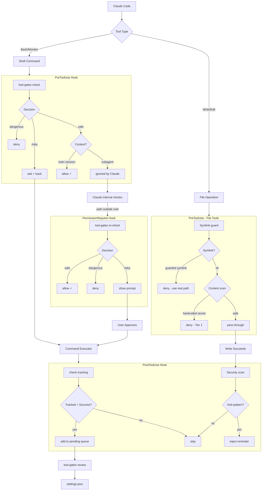

<div align="center">

# Tool Gates

_formerly `bash-gates`_

**Intelligent tool permission gate for AI coding assistants**

[](https://github.com/camjac251/tool-gates/actions/workflows/ci.yml)
[](https://github.com/camjac251/tool-gates/actions/workflows/release.yml)
[](https://www.rust-lang.org/)
[](LICENSE)

A hook for [Claude Code](https://code.claude.com/docs/en/hooks), [Gemini CLI](https://github.com/google-gemini/gemini-cli), and [Codex CLI](https://github.com/openai/codex) that gates Bash commands, file operations, and tool invocations using AST parsing. Determines whether to allow, ask, or block based on potential impact.

[Installation](#installation) · [Permission Gates](#permission-gates) · [Security](#security-features) · [Testing](#testing)

</div>

---

## Features

| Feature                       | Description                                                                                                                                                                                 |
| ----------------------------- | ------------------------------------------------------------------------------------------------------------------------------------------------------------------------------------------- |
| **Approval Learning**         | Tracks approved commands and saves patterns to settings.json via TUI or CLI                                                                                                                 |
| **Settings Integration**      | Respects your `settings.json` allow/deny/ask rules - won't bypass your explicit permissions                                                                                                 |
| **Accept Edits Mode**         | Auto-allows file-editing commands (`sd`, `prettier --write`, etc.) when in acceptEdits mode                                                                                                 |
| **Auto Mode Support**         | Integrates with Claude Code auto mode: deterministic deny floor for dangerous patterns, classifier retry hints                                                                              |
| **Modern CLI Hints**          | Suggests modern alternatives (`bat`, `rg`, `fd`, etc.) via `additionalContext` for the assistant to learn                                                                                   |
| **AST Parsing**               | Uses [tree-sitter-bash](https://github.com/tree-sitter/tree-sitter-bash) for accurate command analysis                                                                                      |
| **Compound Commands**         | Handles `&&`, `\|\|`, `\|`, `;` chains correctly                                                                                                                                            |
| **Security First**            | Catches pipe-to-shell, eval, command injection patterns                                                                                                                                     |
| **Unknown Protection**        | Unrecognized commands are never auto-approved; outside plan mode they require approval                                                                                                      |
| **Claude Code Plugin**        | Install as a plugin with the `/tool-gates:review` skill for interactive approval management                                                                                                 |
| **400+ Commands**             | 13 specialized gates with comprehensive coverage                                                                                                                                            |
| **File Guards**               | Blocks symlinked AI config files (CLAUDE.md, .cursorrules, etc.) to prevent confused reads/edits                                                                                            |
| **Security Reminders**        | Scans Write/Edit content for 28 anti-patterns (secrets, XSS, injection, etc.) across 3 tiers                                                                                                |
| **Head/Tail Pipe Block**      | Denies `\| head` / `\| tail` pipes so stdout is capped at the source via `rg -m N` / `fd --max-results N` / `bat -r START:END` instead                                                      |
| **Tool Blocking**             | Configurable rules to block tools (Glob, Grep, and firecrawl/ref/exa MCP calls to GitHub) with domain filtering                                                                             |
| **Skill Auto-Approval**       | Auto-approve Skill tool calls based on project directory conditions. No external hook scripts needed                                                                                        |
| **MCP Accept-Edits Approval** | Auto-approve named MCP tools when the session is in `acceptEdits` mode. Fills the gap Claude Code leaves open (MCP tools ignore permission mode natively)                                   |
| **Codex Project Edits**       | Auto-approve Codex `apply_patch` edits inside the project (cwd + `additionalDirectories`) on PermissionRequest, honoring settings.json deny/ask rules and file guards. Opt-in via `[codex]` |
| **Configuration**             | `~/.config/tool-gates/config.toml` for feature toggles, custom block rules, and file guard extensions                                                                                       |
| **Health Check**              | `tool-gates doctor` verifies config, hooks, cache files, and flags legacy remnants                                                                                                          |
| **Fast**                      | Single native binary, no interpreter overhead                                                                                                                                               |

---

## How It Works



**Why four hooks? (Claude Code)**

- **PreToolUse**: Gates Bash/Monitor commands, blocks secrets in Write/Edit, provides CLI hints
- **PermissionRequest**: Gates commands for subagents (where PreToolUse's `allow` is ignored)
- **PermissionDenied**: Fires when the auto-mode classifier denies. If tool-gates would allow the same command, emits a `retry: true` hint so the model gets a second shot
- **PostToolUse**: Tracks successful Bash/Monitor execution for approval learning; scans Write/Edit content for security anti-patterns and nudges Claude via `additionalContext`

**Gemini CLI** uses two hooks (`BeforeTool`/`AfterTool`) with the same gate engine. The client is auto-detected from `hook_event_name`. Key differences:

- No `PermissionRequest` (Gemini doesn't have subagent permission hooks)
- No approval tracking (Gemini doesn't provide `tool_use_id`)
- tool-gates emits `"block"` for hard blocks; Gemini also accepts `"deny"`, and exit code 2 blocks
- Security anti-pattern scanning in AfterTool is not yet supported

**Codex CLI** uses three hooks (`PreToolUse`/`PermissionRequest`/`PostToolUse`) with the same gate engine. Codex emits the same `hook_event_name` strings as Claude, so the client is selected via the explicit `--client codex` CLI flag (the installer bakes that flag into the hook command). Key differences from Claude:

- `apply_patch` is the canonical file-edit tool name (matcher aliases `Write` and `Edit` also fire). The patch body lives in `tool_input.command` as a unified diff; tool-gates parses out `*** Add/Update/Delete File:` headers so file_guards and security_reminders run against every affected path
- Codex's parser only honors `permissionDecision: "deny"` on PreToolUse. tool-gates emits empty stdout for Allow/Ask and hands the decision back to Codex, whose `approval_policy` decides whether the user is prompted (see the approval-model bullets below)
- Modern-CLI hints + Tier-3 warnings ride on PostToolUse for Codex today. Codex accepts `additionalContext` on PreToolUse, but tool-gates emits empty stdout for non-deny Pre decisions, so there is no Pre output to attach hints to.
- PermissionRequest accepts only `hookSpecificOutput.decision.behavior` (`allow`/`deny`) plus an optional deny `message`. `addDirectories`, `updatedInput`, `updatedPermissions`, `interrupt` are dropped (worktree approval reduces to a flat allow without path expansion)
- Codex currently reports `permission_mode` as `default` or `bypassPermissions`, not `acceptEdits`, so `[[accept_edits_mcp]]` is inactive for Codex MCP calls
- `apply_patch` file edits can be auto-approved on PermissionRequest via `[codex] accept_project_edits` in `config.toml`, separate from `[[accept_edits_mcp]]`: an in-project patch (cwd + settings.json `additionalDirectories`) auto-allows, while your `Write`/`Edit` deny and ask rules and the file guards still apply. `allow_edits_anywhere` widens it to anywhere on disk
- No PermissionDenied event (no auto-mode classifier in Codex)
- Hook config lives in `~/.codex/hooks.json` (user) or `<repo>/.codex/hooks.json` (project)

**Codex approval model** (whether a tool-gates `ask` actually prompts):

- Prompting is governed by Codex's `approval_policy`, not tool-gates. Only under `approval_policy = "untrusted"` does a non-safe command reach the prompt by default; under `on-request`/`on-failure`, normal sandboxed execution does not prompt, but explicit escalation or sandbox failure can still prompt
- Codex auto-approves its built-in `is_safe_command` read list (`cat`, `ls`, `grep`, `rg`, `sed -n`, `git status/log/diff`, ...) before any hook runs, so tool-gates never sees those on PermissionRequest and can only `deny` them via PreToolUse, never turn them into a prompt
- To route safe-reads through tool-gates, add execpolicy `prefix_rule(pattern=["cat"], decision="prompt")` rules to `~/.codex/rules/default.rules`; they match before the safe-list fallback. No wildcard, so enumerate each program
- Sandbox and approval are orthogonal: disabling the sandbox (`sandbox_mode = "danger-full-access"`) does not reduce prompts (those come from `approval_policy`), it only drops containment
- The `/permissions` "Default" popup flips `approval_policy` to `on-request` for the session only; enabling Guardian ("Approve for me") persists `on-request` to `config.toml`. Both silently disable the prompt layer

> `PermissionRequest` metadata like `blocked_path` and `decision_reason` is optional in Claude Code payloads. tool-gates treats those fields as best-effort context, not required inputs.

**Decision Priority:** `BLOCK > ASK > ALLOW > SKIP`

| Decision  | Wire output                   | Effect                                                                                                                                                                                                                                                                                             |
| :-------: | ----------------------------- | -------------------------------------------------------------------------------------------------------------------------------------------------------------------------------------------------------------------------------------------------------------------------------------------------- |
| **deny**  | `permissionDecision: "deny"`  | Command blocked with reason                                                                                                                                                                                                                                                                        |
|  **ask**  | `permissionDecision: "ask"`   | User prompted (Yes / No, two buttons). Used for hard-deny adjacent patterns and explicit `permissions.ask` matches                                                                                                                                                                                 |
| **defer** | `permissionDecision` omitted  | Claude Code's resolver runs the tool's own permission check, populating the prefix-suggestion that lights up the third "Yes, and don't ask again for X" button. Used for benign gate-engine asks except Claude Code's acceptEdits Bash auto-allow commands that tool-gates did not already approve |
| **allow** | `permissionDecision: "allow"` | Auto-approved                                                                                                                                                                                                                                                                                      |

> Unknown commands are never auto-approved. In default and acceptEdits mode they require approval, in auto mode the classifier decides, and in plan mode mutating unknowns deny.

See the [Permission modes](docs/src/modes.md) docs for how `default`, `plan`, `acceptEdits`, `auto`, and Codex `approval_policy` change these decisions.

### Settings.json Integration

tool-gates reads your Claude Code settings from `~/.claude/settings.json` and `.claude/settings.json` (project) to respect your explicit permission rules:

| settings.json | tool-gates | Result                                                                                                                                                                                                                                             |
| ------------- | ---------- | -------------------------------------------------------------------------------------------------------------------------------------------------------------------------------------------------------------------------------------------------- |
| `deny` rule   | (any)      | **deny** (respects your explicit deny)                                                                                                                                                                                                             |
| `ask` rule    | (any)      | **ask** (respects your explicit ask; two-button prompt)                                                                                                                                                                                            |
| `allow` rule  | dangerous  | **deny** (tool-gates still blocks dangerous)                                                                                                                                                                                                       |
| `allow`/none  | safe       | **allow**                                                                                                                                                                                                                                          |
| none          | unknown    | default/acceptEdits: **defer**; auto: **ask**; plan: **deny** unless the gate proves the command is read-only. In acceptEdits, Claude Code Bash auto-allow commands stay explicit **ask** unless tool-gates' own accept-edits policy approves them |

This ensures tool-gates won't accidentally bypass your explicit deny rules while still providing security against dangerous commands.

**Settings file priority** (highest wins):

| Priority    | Location                                 | Description                   |
| ----------- | ---------------------------------------- | ----------------------------- |
| 1 (highest) | `/etc/claude-code/managed-settings.json` | Enterprise managed            |
| 2           | `.claude/settings.local.json`            | Local project (not committed) |
| 3           | `.claude/settings.json`                  | Shared project (committed)    |
| 4 (lowest)  | `~/.claude/settings.json`                | User settings                 |

### Accept Edits Mode

When Claude Code is in `acceptEdits` mode, tool-gates auto-allows file-editing commands:

```bash
# In acceptEdits mode - auto-allowed
sd 'old' 'new' file.txt           # Text replacement
prettier --write src/             # Code formatting
ast-grep -p 'old' -r 'new' -U .   # Code refactoring
sed -i 's/foo/bar/g' file.txt     # In-place sed
mkdir -p src/components           # Directory creation inside allowed dirs
black src/                        # Python formatting
eslint --fix src/                 # Linting with fix
```

**Still requires approval (even in acceptEdits):**

- Package managers: `npm install`, `cargo add`
- Git operations: `git push`, `git commit`
- Filesystem structure changes: `rm`, `rmdir`, `mv`, `cp`, `touch`
- Blocked commands: `rm -rf /` still denied

**Extending acceptEdits to MCP tools.** Claude Code's `acceptEdits` mode does not extend to MCP tools natively: every MCP tool's internal permission check returns passthrough regardless of mode. tool-gates fills the gap: declare `[[accept_edits_mcp]]` rules in `config.toml` and the named MCP tools auto-allow only when the session is in `acceptEdits`. See the [MCP Accept-Edits Approval](#mcp-accept-edits-approval) configuration section below.

### Auto Mode

_Requires Claude Code 2.1.88+ for the `PermissionDenied` retry hook. Earlier auto-mode-capable builds still get the deny-promotion, pattern narrowing, and pending queue guard._

When Claude Code runs in `auto` permission mode, a server-side classifier decides `ask` calls instead of prompting. tool-gates layers in as a deterministic pre-filter and safety floor:

| tool-gates decision                        | Behavior under auto mode            |
| ------------------------------------------ | ----------------------------------- |
| `allow` (e.g. `git status`, `cargo check`) | Classifier skipped, action executes |
| `ask` (e.g. `cargo install foo`)           | Classifier runs, decides allow/deny |
| `deny` (e.g. `rm -rf /`, `\| bash`)        | Hard floor, classifier bypassed     |

**What changes under auto mode:**

- **Pipe-to-shell and `eval` escalate from ask to deny.** These patterns have no legitimate use case, so they stay in the deterministic floor rather than routing to the classifier.
- **Claude's acceptEdits Bash fast path is not trusted.** Auto mode checks whether a command would be allowed in `acceptEdits` before it asks the classifier. tool-gates now owns that decision: commands like `mkdir -p src/components` and `sed -i ... file` can still allow when they pass tool-gates' path-aware accept-edits policy, while unapproved Claude hardcoded bases such as `rm`, `rmdir`, `mv`, `cp`, and `touch` deny instead of reaching Claude's fast path.
- **Pending queue only tracks human approvals.** Under auto mode the classifier decides silently, so nothing goes into `pending.jsonl`. The review queue stays focused on patterns you explicitly approved.
- **Classifier denials get retry hints.** If the classifier denies a command tool-gates would allow (e.g. `cargo check`), the `PermissionDenied` hook tells the model it may retry.
- **Skill auto-approval still fires.** `[[auto_approve_skills]]` rules are explicit trust declarations and aren't revoked by opting into auto mode.

Configure the Claude Code classifier via `autoMode.{allow,soft_deny,hard_deny,environment}` in settings.json. Inspect the merged config with `claude auto-mode config` (also `defaults`, `critique`).

### Modern CLI Hints

_Requires Claude Code 1.0.20+_

When a supported client uses legacy commands, tool-gates suggests modern alternatives via `additionalContext`. This helps the assistant learn better patterns over time without modifying the command.

```bash
# Claude runs: cat README.md
# tool-gates returns (Claude format):
{
  "hookSpecificOutput": {
    "permissionDecision": "allow",
    "additionalContext": "Tip: Use 'bat README.md' for syntax highlighting and line numbers (Markdown rendering)"
  }
}

# Gemini format (auto-detected):
{"decision":"allow","hookSpecificOutput":{"additionalContext":"Tip: Use 'bat README.md' ..."}}
```

| Legacy Command                | Modern Alternative                 | When triggered                                                                                                                                            |
| ----------------------------- | ---------------------------------- | --------------------------------------------------------------------------------------------------------------------------------------------------------- |
| `cat`, `head`, `tail`, `less` | `bat`                              | Always (`tail -f` excluded)                                                                                                                               |
| `grep` (code patterns)        | `sg`                               | AST-aware code search                                                                                                                                     |
| `grep` (text/log/config)      | `rg`                               | Any grep usage                                                                                                                                            |
| `rg` (code paths)             | Probe / ChunkHound / Serena / `sg` | Routes by pattern shape: identifier → Probe `exact: true`, structural → `sg -p`, natural-language → ChunkHound semantic, `-A`/`-B`/`-C` → sg body capture |
| `find`                        | `fd`                               | Always                                                                                                                                                    |
| `ls`                          | `eza`                              | With `-l` or `-a` flags                                                                                                                                   |
| `sed`                         | `sd`                               | Substitution patterns (`s/.../.../`)                                                                                                                      |
| `awk`                         | `choose`                           | Field extraction (`print $`)                                                                                                                              |
| `du`                          | `dust`                             | Always                                                                                                                                                    |
| `ps`                          | `procs`                            | With `aux`, `-e`, `-A` flags                                                                                                                              |
| `curl`, `wget`                | `xh`                               | JSON APIs or verbose mode                                                                                                                                 |
| `curl`, `wget`, `xh`          | `gh`                               | GitHub content URLs (raw/api/blob/gist)                                                                                                                   |
| `pip`, `python -m pip`        | `uv pip`                           | Subcommand-aware (`install`/`uninstall`/`list`)                                                                                                           |
| `python -m venv`              | `uv venv`                          | Always                                                                                                                                                    |
| `dig`, `nslookup`             | `doggo`                            | Always                                                                                                                                                    |
| `unzip`, `zip`                | `ouch`                             | Always (`zip --version` skipped)                                                                                                                          |
| `tar -x` / `tar xzf`          | `ouch decompress`                  | Extract only; create (`-c`) left alone                                                                                                                    |
| `diff`                        | `difft`                            | Two-file comparisons                                                                                                                                      |
| `xxd`, `hexdump`              | `hexyl`                            | Always                                                                                                                                                    |
| `cloc`                        | `tokei`                            | Always                                                                                                                                                    |
| `tree`                        | `eza -T`                           | Always                                                                                                                                                    |
| `man`                         | `tldr`                             | Always                                                                                                                                                    |
| `wc -l`                       | `rg -c`                            | Line counting                                                                                                                                             |

**Only suggests installed tools.** Hints are cached (7-day TTL) to avoid repeated `which` calls.

```bash
# Refresh tool detection cache
tool-gates --refresh-tools

# Check which tools are detected
tool-gates --tools-status
```

### Security Reminders

When a supported client writes code through a write/edit tool, tool-gates scans the content for 28 security anti-patterns organized into three tiers. That includes Claude `Write`/`Edit`, Gemini `write_file`/`replace` on the before-tool path, and Codex `apply_patch` added lines.

| Tier       | Hook                   | Decision                 | Behavior                                                                                                                                                                                                                                          |
| ---------- | ---------------------- | ------------------------ | ------------------------------------------------------------------------------------------------------------------------------------------------------------------------------------------------------------------------------------------------- |
| **Tier 1** | PreToolUse             | `deny` + `systemMessage` | Hardcoded secrets blocked before write. Tier-1 denies surface to the operator via top-level `systemMessage` so the block isn't silent. Routine denies (head/tail pipe, settings.json matches, procedural gate denies) stay silent at the UI level |
| **Tier 2** | PostToolUse            | `additionalContext`      | Anti-patterns flagged after write. Claude and Codex get a nudge to fix; Gemini AfterTool output is not plumbed for Tier 2 yet                                                                                                                     |
| **Tier 3** | PreToolUse/PostToolUse | `allow` + context        | Informational warnings injected without blocking. Claude/Gemini carry these on PreToolUse/BeforeTool; Codex carries them on PostToolUse because non-deny PreToolUse output is empty stdout                                                        |

**Tier 1: Secrets (denied before source writes):**
AWS access keys (`AKIA...`), private keys (`-----BEGIN * PRIVATE KEY`), GitHub tokens (`ghp_/ghs_/ghu_/gho_/ghr_`), Stripe/Slack/Google API keys, GitHub Actions workflow injection.

**Tier 2: Anti-patterns (post-write nudge, once per file+rule per session):**
`eval()`, `child_process.exec`, `new Function()`, `os.system()`, `pickle.load`, `dangerouslySetInnerHTML`, `document.write()`, `.innerHTML =`, `yaml.load()` without SafeLoader, SQL f-string interpolation, `subprocess` with `shell=True`, `render_template_string()` (Flask SSTI), `marshal.load`/`shelve.open`, `__import__()`, PHP `unserialize()`.

**Tier 3: Informational (allow with warning, once per session):**
SSL `verify=False`, `chmod 777`, MD5/SHA1 for security, CORS wildcard `*`, Vue `v-html=`, template `autoescape=False`, `Math.random()` for security tokens, JS `createHash` md5/sha1.

**Why Tier 2 uses PostToolUse:** The write lands without blocking. The assistant sees a `<system-reminder>` with the security warning and can self-correct in its next action. No wasted edits from re-prompting. Deduped per (file, rule) per session so you only see each warning once.

Documentation files (.md, .txt, .rst, etc.) skip Tier 2/3 content checks. Tier 1 secrets in source files deny before write; Tier 1 secrets in docs get a PostToolUse warning; dedicated secret files (`.env`, `.envrc`, `.env.*`) skip secret detection because they exist to hold secrets.

```toml
# ~/.config/tool-gates/config.toml
[features]
security_reminders = true  # default

[security_reminders]
disable_rules = ["eval_injection"]  # skip specific rules
```

### Approval Learning

When you approve commands (via Claude Code's permission prompt), tool-gates tracks them and lets you permanently save patterns to settings.json.

```bash
# After approving some commands, review pending approvals
tool-gates pending list
tool-gates pending list --project

# Interactive TUI dashboard
tool-gates review          # current project only
tool-gates review --all    # all projects

# Or approve directly via CLI
tool-gates approve 'npm install*' -s local
tool-gates approve 'cargo*' -s user

# Manage existing rules
tool-gates rules list
tool-gates rules remove 'pattern' -s local

# Audit `permissions.ask` rules that suppress the third prompt button
tool-gates rules ask-audit            # categorized listing
tool-gates rules ask-audit --apply    # multi-select TUI checklist
```

**Why ask-audit?** Whenever a `permissions.ask` rule in settings.json matches a command, Claude Code's resolver shows two buttons (Yes / No) instead of three. The third "Yes, and don't ask again for X" button is suppressed because the resolver returns ask without populating the prefix-suggestion. `ask-audit` categorizes each rule by what tool-gates would do without it (gate-covered, safety floor, indeterminate) and offers per-rule removal.

**Scopes:**
| Scope | File | Use case |
|-------|------|----------|
| `local` | `.claude/settings.local.json` | Personal project overrides (not committed) |
| `user` | `~/.claude/settings.json` | Global personal use |
| `project` | `.claude/settings.json` | Share with team |

**Review TUI** (`tool-gates review`):

Three-panel dashboard with project sidebar, command list, and detail panel.

- **Sidebar**: Lists projects with pending counts, auto-selects current project. Click or arrow to switch.
- **Command list**: Full commands with color-coded segments (green=allowed, yellow=ask, red=blocked). Multi-select with Space for batch operations.
- **Detail panel**: Shows segment breakdown, pattern (cycle with Left/Right), scope (cycle with Left/Right), and action buttons.

Compound commands (`&&`, `||`, `|`) show per-segment patterns so you can approve individual parts.

| Key                       | Action                                            |
| ------------------------- | ------------------------------------------------- |
| `Tab`                     | Cycle panel focus (Sidebar -> Commands -> Detail) |
| `Up`/`Down` or `j`/`k`    | Navigate within focused panel                     |
| `Left`/`Right` or `h`/`l` | Cycle pattern or scope (in detail panel)          |
| `Space`                   | Toggle multi-select on command                    |
| `Enter`                   | Approve selected command(s)                       |
| `d`                       | Skip (remove from pending)                        |
| `D`                       | Deny (add to settings.json deny list)             |
| `q` or `Esc`              | Quit                                              |

---

## Installation

### Homebrew (Recommended)

```bash
brew install camjac251/tap/tool-gates
```

Upgrades work normally after the initial install:

```bash
brew upgrade tool-gates
```

Bottles are built for macOS (arm64, x86_64) and Linux (arm64, x86_64). Formulas are updated automatically when new releases are published.

### Download Binary

```bash
# Linux x64
curl -Lo ~/.local/bin/tool-gates \
  https://github.com/camjac251/tool-gates/releases/latest/download/tool-gates-linux-x86_64
chmod +x ~/.local/bin/tool-gates

# Linux ARM64
curl -Lo ~/.local/bin/tool-gates \
  https://github.com/camjac251/tool-gates/releases/latest/download/tool-gates-linux-arm64
chmod +x ~/.local/bin/tool-gates

# macOS Apple Silicon
curl -Lo ~/.local/bin/tool-gates \
  https://github.com/camjac251/tool-gates/releases/latest/download/tool-gates-macos-arm64
chmod +x ~/.local/bin/tool-gates

# macOS Intel
curl -Lo ~/.local/bin/tool-gates \
  https://github.com/camjac251/tool-gates/releases/latest/download/tool-gates-macos-x86_64
chmod +x ~/.local/bin/tool-gates
```

Windows binaries are available for Bash-like environments such as Git Bash or MSYS2. PowerShell/cmd.exe command classification is not first-class yet; WSL users should use the Linux binary.

### Build from Source

```bash
# Requires Rust 1.86+
cargo build --release
# Binary: ./target/release/tool-gates

# Static Linux musl build
cargo build --release --target x86_64-unknown-linux-musl
# Binary: ./target/x86_64-unknown-linux-musl/release/tool-gates
```

### Configure

```bash
# Claude Code (recommended)
tool-gates hooks add -s user

# Gemini CLI
tool-gates hooks add --gemini

# Codex CLI
tool-gates hooks add --codex

# Install to project settings (shared with team)
tool-gates hooks add -s project

# Check installation status (all three clients)
tool-gates hooks status

# Preview changes without writing
tool-gates hooks add -s user --dry-run
tool-gates hooks add --gemini --dry-run
tool-gates hooks add --codex --dry-run
```

#### Claude Code

| Scope     | File                          | Use case                   |
| --------- | ----------------------------- | -------------------------- |
| `user`    | `~/.claude/settings.json`     | Personal use (recommended) |
| `project` | `.claude/settings.json`       | Share with team            |
| `local`   | `.claude/settings.local.json` | Personal project overrides |

**All four hooks are installed:**

- `PreToolUse` - Gates Bash/Monitor commands, blocks secrets in Write/Edit, file guards, CLI hints, MCP tool blocking, Skill auto-approval
- `PermissionRequest` - Gates commands for subagents (where PreToolUse's allow is ignored)
- `PermissionDenied` - Emits retry hints when the auto-mode classifier denies a command tool-gates would allow
- `PostToolUse` - Tracks Bash/Monitor execution for approval learning; scans Write/Edit for security anti-patterns

<details>
<summary>Manual installation</summary>

Add to `~/.claude/settings.json`:

```json
{
  "hooks": {
    "PreToolUse": [
      {
        "matcher": "Bash|Monitor|Read|Write|Edit|Glob|Grep|Skill",
        "hooks": [
          {
            "type": "command",
            "command": "~/.local/bin/tool-gates",
            "timeout": 10
          }
        ]
      },
      {
        "matcher": "mcp__.*",
        "hooks": [
          {
            "type": "command",
            "command": "~/.local/bin/tool-gates",
            "timeout": 10
          }
        ]
      }
    ],
    "PermissionRequest": [
      {
        "matcher": "Bash|Monitor|Write|Edit",
        "hooks": [
          {
            "type": "command",
            "command": "~/.local/bin/tool-gates",
            "timeout": 10
          }
        ]
      }
    ],
    "PermissionDenied": [
      {
        "matcher": "Bash|Monitor",
        "hooks": [
          {
            "type": "command",
            "command": "~/.local/bin/tool-gates",
            "timeout": 10
          }
        ]
      }
    ],
    "PostToolUse": [
      {
        "matcher": "Bash|Monitor|Write|Edit",
        "hooks": [
          {
            "type": "command",
            "command": "~/.local/bin/tool-gates",
            "timeout": 10
          }
        ]
      }
    ]
  }
}
```

</details>

### Claude Code Plugin (Optional)

tool-gates ships as a [Claude Code plugin](https://code.claude.com/docs/en/plugins) with the `/tool-gates:review` skill for interactive approval management. The plugin provides the skill only. Hook installation is handled by the binary (see [Configure](#configure) above).

**Prerequisites:** The `tool-gates` binary must be installed and hooks configured before using the plugin.

**Install from marketplace:**

```bash
# In Claude Code, add the marketplace
/plugin marketplace add camjac251/tool-gates

# Install the plugin
/plugin install tool-gates@camjac251-tool-gates
```

**Install from local clone:**

```bash
# Launch Claude Code with the plugin loaded
claude --plugin-dir /path/to/tool-gates/claude-plugin
```

**Using the review skill:**

```bash
# Review all pending approvals
/tool-gates:review

# Review only current project
/tool-gates:review --project
```

The skill lists commands you've been manually approving, shows counts and suggested patterns, and lets you multi-select which to make permanent at your chosen scope (local, project, or user).

| Step                   | What happens                                | Permission                 |
| ---------------------- | ------------------------------------------- | -------------------------- |
| List pending approvals | `tool-gates pending list`                   | Auto-approved (read-only)  |
| Show current rules     | `tool-gates rules list`                     | Auto-approved (read-only)  |
| Approve a pattern      | `tool-gates approve '<pattern>' -s <scope>` | Requires your confirmation |

#### Gemini CLI

Requires Gemini CLI **v0.36.0+** (`ask` decision support for BeforeTool hooks).

| Scope     | File                      | Use case               |
| --------- | ------------------------- | ---------------------- |
| `user`    | `~/.gemini/settings.json` | Personal use (default) |
| `project` | `.gemini/settings.json`   | Share with team        |

Two hooks are installed: `BeforeTool`, `AfterTool`

<details>
<summary>Manual installation</summary>

Add to `~/.gemini/settings.json`:

```json
{
  "hooks": {
    "BeforeTool": [
      {
        "matcher": "run_shell_command|read_file|read_many_files|write_file|replace|glob|grep_search|activate_skill",
        "hooks": [
          {
            "type": "command",
            "command": "~/.local/bin/tool-gates",
            "timeout": 5000
          }
        ]
      },
      {
        "matcher": "mcp_.*",
        "hooks": [
          {
            "type": "command",
            "command": "~/.local/bin/tool-gates",
            "timeout": 5000
          }
        ]
      }
    ],
    "AfterTool": [
      {
        "matcher": "run_shell_command|write_file|replace",
        "hooks": [
          {
            "type": "command",
            "command": "~/.local/bin/tool-gates",
            "timeout": 5000
          }
        ]
      }
    ]
  }
}
```

</details>

The Claude/Gemini client is auto-detected from the `hook_event_name` field; the same binary handles both. Codex shares Claude's event names, so it requires `--client codex` baked into the hook command (the installer does this for you).

#### Codex CLI

| Scope     | File                  | Use case               |
| --------- | --------------------- | ---------------------- |
| `user`    | `~/.codex/hooks.json` | Personal use (default) |
| `project` | `.codex/hooks.json`   | Share with team        |

Three hooks are installed: `PreToolUse`, `PermissionRequest`, `PostToolUse`. Each command embeds `--client codex` so tool-gates routes the wire format correctly. MCP tools are covered on PreToolUse for block rules; Codex does not currently expose an `acceptEdits` mode for MCP PermissionRequest auto-approval.

<details>
<summary>Manual installation</summary>

Add to `~/.codex/hooks.json`:

```json
{
  "hooks": {
    "PreToolUse": [
      {
        "matcher": "Bash|apply_patch",
        "hooks": [
          {
            "type": "command",
            "command": "~/.local/bin/tool-gates --client codex",
            "timeout": 30
          }
        ]
      },
      {
        "matcher": "mcp__.*",
        "hooks": [
          {
            "type": "command",
            "command": "~/.local/bin/tool-gates --client codex",
            "timeout": 30
          }
        ]
      }
    ],
    "PermissionRequest": [
      {
        "matcher": "Bash|apply_patch",
        "hooks": [
          {
            "type": "command",
            "command": "~/.local/bin/tool-gates --client codex",
            "timeout": 30
          }
        ]
      }
    ],
    "PostToolUse": [
      {
        "matcher": "Bash|apply_patch",
        "hooks": [
          {
            "type": "command",
            "command": "~/.local/bin/tool-gates --client codex",
            "timeout": 30
          }
        ]
      }
    ]
  }
}
```

</details>

---

## Permission Gates

### Tool Gates (Self)

tool-gates recognizes its own CLI commands:

| Allow                                                                                                                            | Ask                                                                                                                                          |
| -------------------------------------------------------------------------------------------------------------------------------- | -------------------------------------------------------------------------------------------------------------------------------------------- |
| `pending list`, `rules list`, `rules ask-audit`, `hooks status`, `hooks json`, `doctor`, `--help`, `--version`, `--tools-status` | `approve`, `rules remove`, `rules ask-audit --apply`, `pending clear [--project \| --all] --force`, `hooks add`, `review`, `--refresh-tools` |

### Basics

~180 safe read-only commands: `echo`, `cat`, `ls`, `grep`, `rg`, `awk`, `sed` (no -i), `ps`, `whoami`, `date`, `jq`, `yq`, `bat`, `fd`, `tokei`, `hexdump`, `glow`, `jc`, `mktemp`, and more. Custom handlers for `xargs` (safe only with known-safe targets) and `bash -c`/`sh -c` (parses inner script).

### Beads Issue Tracker

[Beads](https://github.com/steveyegge/beads) - Git-native issue tracking

| Allow                                                                                | Ask                                                                              |
| ------------------------------------------------------------------------------------ | -------------------------------------------------------------------------------- |
| `list`, `show`, `ready`, `blocked`, `search`, `stats`, `doctor`, `dep tree`, `prime` | `create`, `update`, `close`, `delete`, `sync`, `init`, `dep add`, `comments add` |

### GitHub CLI

| Allow                                                       | Ask                                                  | Block                        |
| ----------------------------------------------------------- | ---------------------------------------------------- | ---------------------------- |
| `pr list`, `issue view`, `repo view`, `search`, `api` (GET) | `pr create`, `pr merge`, `issue create`, `repo fork` | `repo delete`, `auth logout` |

### Git

| Allow                                        | Ask                                      | Ask (warning)                               |
| -------------------------------------------- | ---------------------------------------- | ------------------------------------------- |
| `status`, `log`, `diff`, `show`, `branch -a` | `add`, `commit`, `push`, `pull`, `merge` | `push --force`, `reset --hard`, `clean -fd` |

User-defined aliases in `~/.gitconfig` resolve through these rules: `git st` allows as `status`, `git lg` as `log`, `git astatus` as `status` (the leading `-c color.ui=false` is stripped before resolution), `git co main` asks as `checkout`. Built-ins win over aliases (`alias.status = log` doesn't shadow real `status`). Shell-prefixed aliases (`!cmd`) and chains beyond depth 5 ask. See the [Git Aliases](#git-aliases) configuration section.

### Shortcut CLI

[shortcut-cli](https://github.com/shortcut-cli/shortcut-cli) - Community CLI for Shortcut

| Allow                                                                                 | Ask                                                                                        |
| ------------------------------------------------------------------------------------- | ------------------------------------------------------------------------------------------ |
| `search`, `find`, `story` (view), `members`, `epics`, `workflows`, `projects`, `help` | `create`, `install`, `story` (with update flags), `search --save`, `api` (POST/PUT/DELETE) |

### Cloud CLIs

AWS, gcloud, terraform, kubectl, docker, podman, az, helm, pulumi

| Allow                                         | Ask                                        | Block                                      |
| --------------------------------------------- | ------------------------------------------ | ------------------------------------------ |
| `describe-*`, `list-*`, `get`, `show`, `plan` | `create`, `delete`, `apply`, `run`, `exec` | `iam delete-user`, `delete ns kube-system` |

Docker extended: `buildx ls/inspect` allow, `buildx build/prune` ask. `scout quickview/cves` allow. `context/manifest/image/container` read subcommands allow, mutations ask.

kubectl: `diff`, `kustomize`, `wait` allow. `debug` asks. terraform: `workspace show` allow. `test`, `console`, `force-unlock` ask.

### Network

| Allow                                    | Ask                                                                                                      | Block                             |
| ---------------------------------------- | -------------------------------------------------------------------------------------------------------- | --------------------------------- |
| `curl` (GET non-GitHub), `wget --spider` | `curl -X POST`, `wget`, `ssh`, `rsync`, `nmap`, `socat`, `telnet`, `curl/xh` against GitHub content URLs | `nc -e/-c/--exec` (reverse shell) |

### Filesystem

| Allow                 | Ask                                 | Block                  |
| --------------------- | ----------------------------------- | ---------------------- |
| `tar -tf`, `unzip -l` | `rm`, `mv`, `cp`, `chmod`, `sed -i` | `rm -rf /`, `rm -rf ~` |

### Language Runtimes

python3/python, node, ruby, deno, php, lua/luajit, java/javac, dotnet, swift, elixir/iex

| Allow                                                                | Ask                                              |
| -------------------------------------------------------------------- | ------------------------------------------------ |
| `--version`, `--help`, syntax check (`node -c`, `ruby -c`, `php -l`) | `-c`/`-e`/`-m` (code execution), running scripts |

deno: `check`, `lint`, `test`, `fmt --check` allow. `run`, `fmt`, `install`, `publish` ask. dotnet: `build`, `test`, `run` allow. `publish`, `new`, `add` ask.

### Developer Tools

77+ tools with write-flag detection.

**Linters/type checkers (read-only, always allow):** `eslint`, `biome`, `ruff`, `pylint`, `flake8`, `mypy`, `pyright`, `bandit`, `shellcheck`, `hadolint`, `golangci-lint`, `oxlint`, `stylelint`

**Test runners (allow):** `jest`, `vitest`, `mocha`, `pytest`, `playwright test`, `cypress run`

**Formatters (allow with check flags, ask with write flags):** `prettier`, `black`, `isort`, `ruff format`, `biome format`, `gofmt`, `rustfmt`, `shfmt`, `autopep8`, `clang-format`

**Build tools (allow):** `vite`, `esbuild`, `tsup`, `turbo`, `nx`, `webpack`, `rollup`, `swc`, `tsc`

**Code execution (ask):** `tsx`, `ts-node`, `watchexec`, `tox`, `nox`

**Other:** `sd` (pipe mode safe, file args ask), `coverage report` allow / `coverage run/html/json` ask, `wrangler whoami` allow / `wrangler dev/deploy` ask

### Package Managers

npm, pnpm, yarn, pip, uv, cargo, go, bun, conda, poetry, pipx, mise

| Allow                                  | Ask                                          |
| -------------------------------------- | -------------------------------------------- |
| `list`, `show`, `test`, `build`, `dev` | `install`, `add`, `remove`, `publish`, `run` |

cargo extended: `nextest`, `audit`, `deny check`, `expand`, `semver-checks`, `llvm-cov`, `outdated`, `bloat` allow. `watch`, `mutants`, `insta review/accept` ask.

### System

**Database CLIs:** psql, mysql, sqlite3, mongosh, redis-cli
**Build tools:** make, cmake, ninja, just, gradle, maven, bazel
**OS Package managers:** apt, brew, pacman, nix, dnf, zypper, flatpak, snap
**Crypto tools:** openssl, gpg/gpg2, ssh-keygen, age
**Other:** sudo, systemctl, crontab, kill

| Allow                                           | Ask                               | Block                                                             |
| ----------------------------------------------- | --------------------------------- | ----------------------------------------------------------------- |
| `psql -l`, `make test`, `sudo -l`, `apt search` | `make deploy`, `sudo apt install` | `shutdown`, `reboot`, `mkfs`, `dd`, `fdisk`, `iptables`, `passwd` |

openssl: `version`, `x509`, `s_client`, `dgst`, `verify` allow. `genrsa`, `req`, `enc` ask. gpg: `--list-keys`, `--verify` allow. `--sign`, `--encrypt`, `--gen-key` ask. ssh-keygen: `-l` (fingerprint) allow. Key generation asks.

---

## Security Features

### Pre-AST Security Checks

Comments are stripped before checking (quote-aware, respects bash word-boundary rules for `#`) so patterns inside comments don't trigger false positives.

```bash
curl https://example.com | bash     # ask - pipe to shell
eval "rm -rf /"                     # ask - arbitrary execution
source ~/.bashrc                    # ask - sourcing script
echo $(rm -rf /tmp/*)               # ask - dangerous substitution
find . | xargs rm                   # ask - xargs to rm
echo "data" > /etc/passwd           # ask - output redirection
ls | head -20                       # deny - cap with rg -m / fd --max-results / bat -r
```

### Compound Command Handling

Strictest decision wins:

```bash
git status && rm -rf /     # deny  (rm -rf / blocked)
git status && npm install  # ask   (npm install needs approval)
git status && git log      # allow (both read-only)
```

### Smart sudo Handling

```bash
sudo apt install vim          # ask - "sudo: Installing packages (apt)"
sudo systemctl restart nginx  # ask - "sudo: systemctl restart"
```

---

## Testing

```bash
cargo test                        # Full suite
cargo test gates::git             # Specific gate
cargo test -- --nocapture         # With output
```

### Manual Testing

```bash
# Claude Code format
echo '{"tool_name":"Bash","tool_input":{"command":"git status"}}' | tool-gates
# -> {"hookSpecificOutput":{"hookEventName":"PreToolUse","permissionDecision":"allow","permissionDecisionReason":"Read-only operation"}}

echo '{"tool_name":"Bash","tool_input":{"command":"npm install"}}' | tool-gates
# -> {"hookSpecificOutput":{"hookEventName":"PreToolUse","permissionDecisionReason":"npm: Installing packages"}}
# permissionDecision is omitted so Claude Code can show the three-button prompt.

echo '{"tool_name":"Bash","tool_input":{"command":"rm -rf /"}}' | tool-gates
# -> {"hookSpecificOutput":{"hookEventName":"PreToolUse","permissionDecision":"deny","permissionDecisionReason":"rm: `rm -rf /` blocked: would recursively delete the entire root filesystem."}}

# Gemini CLI format (auto-detected from hook_event_name)
echo '{"hook_event_name":"BeforeTool","tool_name":"run_shell_command","tool_input":{"command":"git status"}}' | tool-gates
# -> {"decision":"allow","reason":"Read-only operation"}

echo '{"hook_event_name":"BeforeTool","tool_name":"run_shell_command","tool_input":{"command":"rm -rf /"}}' | tool-gates
# -> {"decision":"block","reason":"rm: rm -rf / blocked"}  (exit code 2)

# Codex CLI format (selected via --client codex flag, since event names match Claude)
echo '{"hook_event_name":"PreToolUse","tool_name":"Bash","tool_input":{"command":"git status"},"cwd":"/tmp","session_id":"s","tool_use_id":"u","permission_mode":"default","transcript_path":null}' | tool-gates --client codex
# -> (empty stdout, exit 0: pass through to Codex; prompting depends on approval_policy/execpolicy)

echo '{"hook_event_name":"PreToolUse","tool_name":"Bash","tool_input":{"command":"rm -rf /"},"cwd":"/tmp","session_id":"s","tool_use_id":"u","permission_mode":"default","transcript_path":null}' | tool-gates --client codex
# -> {"hookSpecificOutput":{"hookEventName":"PreToolUse","permissionDecision":"deny","permissionDecisionReason":"rm: rm -rf / blocked"}}

echo '{"hook_event_name":"PreToolUse","tool_name":"apply_patch","tool_input":{"command":"*** Begin Patch\n*** Update File: /home/me/CLAUDE.md\n@@\n-old\n+new\n*** End Patch\n"},"cwd":"/tmp","session_id":"s","tool_use_id":"u","permission_mode":"default","transcript_path":null}' | tool-gates --client codex
# -> deny if /home/me/CLAUDE.md is a guarded symlink, empty stdout otherwise
```

---

## Configuration

All configuration is in `~/.config/tool-gates/config.toml`. The file is optional. If missing, all features are enabled with sensible defaults.

### Feature Toggles

```toml
[features]
bash_gates = true            # AST-based Bash command gating (default: true)
file_guards = true           # Symlink guard for AI config files (default: true)
hints = true                 # Modern CLI hints, e.g. cat->bat, grep->rg, etc. (default: true)
security_reminders = true    # Scan Write/Edit for security anti-patterns (default: true)
head_tail_pipe_block = true  # Deny `| head -N` / `| tail -N` pipes (default: true)
git_aliases = true           # Resolve user-defined git aliases (default: true)
```

### Git Aliases

When enabled, the git gate resolves user-defined aliases against `~/.gitconfig` so they apply the same rules as the underlying subcommand. `git st` allows as `status`, `git lg` as `log`, `git astatus` as `status` (the leading `-c color.ui=false` is stripped first), `git co main` asks as `checkout`. Without this, every alias hits the default ask path.

```toml
[git_aliases]
include_local_repo = false   # Also read $REPO/.git/config aliases (default: false)
```

Resolution rules:

- **Built-ins win.** `alias.status = log` does not shadow real `status`.
- **Shell aliases (`!cmd`) ask.** Resolving the body would mean re-running it through the gate engine.
- **Chained aliases recurse to depth 5** with cycle detection.
- **Compound bodies** (`alias.foo = log; rm -rf .`) get re-checked through the raw-string deny pass after rewrite.
- **Repo-local aliases are off by default.** A malicious alias in a third-party repo should not silently inherit alias trust on first checkout. Local entries shadow global by name when enabled.
- The alias map is read once per process via `git config --global --get-regexp '^alias\.'` (~30ms cold).

### Head/Tail Pipe Block

`head_tail_pipe_block` denies `| head` and `| tail` pipes so the agent caps output at the source with native limits like `rg -m N`, `fd --max-results N`, and `bat -r START:END` instead of truncating stdout after the fact.

Carve-outs that do not trigger:

- **Streaming** `| tail -f` / `| tail -F` (the Monitor tool's log-watching idiom)
- **Stderr-combining** `|& tail -f` / `|& tail -F`
- **Quoted literals** like `rg '| head' file.txt` where `| head` is a search pattern, not a shell pipe
- **No upstream pipe**, e.g. `head file.txt` or `tail -n 20 README.md`

Set the toggle to `false` to disable.

### Security Reminders

```toml
[security_reminders]
secrets = true         # Tier 1: hardcoded secrets deny by default
anti_patterns = true   # Tier 2: eval, exec, innerHTML, etc. PostToolUse nudge (default: true)
warnings = true        # Tier 3: SSL verify=False, chmod 777, etc. Informational (default: true)
disable_rules = ["eval_injection", "pickle_deserialization"]  # skip individual rules
```

<details>
<summary>All 28 rule names (click to expand)</summary>

| Tier | Rule Name                      | Detects                                               |
| :--: | ------------------------------ | ----------------------------------------------------- |
|  1   | `hardcoded_aws_key`            | AWS access keys (`AKIA...`)                           |
|  1   | `hardcoded_private_key`        | RSA/EC/DSA/SSH private keys                           |
|  1   | `hardcoded_github_token`       | GitHub PATs (`ghp_`, `ghs_`, etc.)                    |
|  1   | `hardcoded_generic_secret`     | Stripe (`sk-`), Slack (`xoxb-`), Google (`AIza`) keys |
|  1   | `github_actions_injection`     | Untrusted input in GHA `run:` blocks                  |
|  2   | `child_process_exec`           | `child_process.exec` / `execSync`                     |
|  2   | `new_function_injection`       | `new Function()` code injection                       |
|  2   | `eval_injection`               | `eval()` arbitrary code execution                     |
|  2   | `os_system_injection`          | `os.system()` shell injection                         |
|  2   | `pickle_deserialization`       | `pickle.load` / `pickle.loads`                        |
|  2   | `dangerous_inner_html`         | React `dangerouslySetInnerHTML`                       |
|  2   | `document_write_xss`           | `document.write()` XSS                                |
|  2   | `inner_html_assignment`        | `.innerHTML =` XSS                                    |
|  2   | `unsafe_yaml_load`             | `yaml.load()` without SafeLoader                      |
|  2   | `sql_string_interpolation`     | SQL via f-strings / `.execute(f"...")`                |
|  2   | `subprocess_shell_true`        | `subprocess.run(..., shell=True)`                     |
|  2   | `flask_ssti`                   | `render_template_string()` SSTI                       |
|  2   | `marshal_deserialization`      | `marshal.load` / `shelve.open`                        |
|  2   | `python_dynamic_import`        | `__import__()` injection                              |
|  2   | `php_unserialize`              | PHP `unserialize()` object injection                  |
|  3   | `ssl_verification_disabled`    | `verify=False` / `rejectUnauthorized: false`          |
|  3   | `chmod_777`                    | `chmod 777` / `0o777` overly permissive               |
|  3   | `weak_crypto_hash`             | `hashlib.md5()` / `hashlib.sha1()`                    |
|  3   | `cors_wildcard`                | `Access-Control-Allow-Origin: *`                      |
|  3   | `vue_v_html`                   | Vue `v-html=` XSS                                     |
|  3   | `template_autoescape_disabled` | Jinja2/Django `autoescape=False`                      |
|  3   | `math_random_security`         | `Math.random()` for security tokens/IDs               |
|  3   | `js_weak_crypto_hash`          | JS `createHash('md5')` / `createHash('sha1')`         |

</details>

### Tool Blocking

```toml
# Override built-in block rules (Glob, Grep, and firecrawl/ref/exa blocked for GitHub).
# Omit entirely to use defaults. Set to [] to disable all blocking.
[[block_tools]]
tool = "Glob"
message = "Use 'fd' instead of Glob."
requires_tool = "fd"   # only block if fd is installed

[[block_tools]]
tool = "*firecrawl*"
message = "Use 'gh api' for GitHub URLs."
block_domains = ["github.com", "raw.githubusercontent.com"]
requires_tool = "gh"
```

### File Guards

```toml
[file_guards]
extra_names = [".teamrules"]       # additional filenames to protect from symlink attacks
extra_dirs = [".myide"]            # additional directory names to protect
extra_prefixes = [".myrules-"]     # additional filename prefixes
extra_extensions = [".toml"]       # additional extensions in guarded dirs
```

### Hints

```toml
[hints]
disable = ["man", "du"]  # suppress hints for specific legacy commands
```

### Skill Auto-Approval

```toml
[[auto_approve_skills]]
skill = "my-plugin*"                        # Glob pattern for skill name
if_project_has = [".my-plugin"]             # Only approve if project dir contains this

[[auto_approve_skills]]
skill = "deploy-tool"                       # Exact match
if_project_under = ["~/projects/staging"]   # Only approve if project is under this path
```

Auto-approve Skill tool calls based on configurable rules. Supports `~` expansion in paths. Replaces external Python/bash hooks. If no rules are configured, Skill calls pass through to Claude Code's normal flow.

| Condition          | Description                                                   |
| ------------------ | ------------------------------------------------------------- |
| `if_project_has`   | Project directory must contain one of these files/directories |
| `if_project_under` | Project directory must be at or under one of these paths      |
| _(no conditions)_  | Skill is auto-approved unconditionally                        |

### Codex Project Edits

```toml
[codex]
accept_project_edits = true    # default false
allow_edits_anywhere = false   # default false
```

Auto-approve Codex `apply_patch` edits on the PermissionRequest hook when every
touched path is inside the project (session cwd + `additionalDirectories` from
`settings.json`) and no path is denied, asked, or guarded. Codex shell commands
are also evaluated as `acceptEdits`, so in-project file-editing commands (`sd`,
`prettier --write`, `mkdir -p`, `sed -i`, ...) auto-allow while dangerous bases
(`rm`, `mv`, `cp`) and out-of-project targets still prompt. Mirrors Claude Code's
`acceptEdits` for Codex.

The auto-allow honors your `~/.claude/settings.json` `Write(...)` / `Edit(...)` /
`MultiEdit(...)` rules: a `deny` pattern denies the patch, an `ask` pattern
(`Write(**/.env*)`, `Write(**/secrets/**)`, `Edit(**/package-lock.json)`) still
prompts, and the AI-config file guards still prompt. Patterns match
gitignore-style, so `**/package-lock.json` matches at any depth. For a multi-file
patch the strictest path decision wins.

`allow_edits_anywhere = true` widens the auto-allow to edits anywhere on disk,
still subject to every deny/ask pattern and file guard.

### MCP Accept-Edits Approval

```toml
[[accept_edits_mcp]]
tool = "mcp__serena__replace_symbol_body"   # exact tool name

[[accept_edits_mcp]]
tool = "mcp__serena__*"                      # all tools on a server
reason = "Symbol edits batched through acceptEdits"

[[accept_edits_mcp]]
tool = "mcp__playwright__browser_click"
if_project_under = ["~/projects/trusted"]    # scope to a directory tree

[[accept_edits_mcp]]
tool = "*firecrawl*"                          # matches Claude (mcp__) and Gemini (mcp_) namespaces
if_project_has = [".firecrawl-ok"]
```

Auto-approve MCP tool calls **only when the session is in `acceptEdits` mode**. In any other mode the rules are inert and the MCP tool falls through to whatever `permissions.allow` in `settings.json` decides. Directory conditions and glob matching are identical to `auto_approve_skills`. Codex currently reports only `default` or `bypassPermissions`, so this MCP feature is inactive for Codex MCP calls until Codex exposes an `acceptEdits` hook mode. Codex `apply_patch` file edits have their own opt-in (`[codex] accept_project_edits`); see [Codex Project Edits](#codex-project-edits).

**Why this exists.** Claude Code's acceptEdits only natively auto-approves Edit/Write/NotebookEdit, Read (in allowed dirs), and a small fixed Bash set (`mkdir, touch, rm, rmdir, mv, cp, sed`). MCP tools ignore permission mode entirely: their internal `checkPermissions` always returns passthrough, so acceptEdits gains them nothing. This config surface is the tool-gates extension: "prompt me normally, batch me through in acceptEdits" for named MCP tools.

**Safety.** Block rules (e.g. the default firecrawl/ref/exa GitHub-URL blocks) run before these allow rules, so `[[accept_edits_mcp]]` cannot unlock a blocked tool.

**Don't double-gate with `permissions.ask`.** Claude Code evaluates `settings.json` `permissions.ask` _after_ the PreToolUse hook returns. If the MCP tool also matches an ask rule there, that rule overrides the hook's `allow` and the prompt shows anyway (logged as `Hook returned 'allow' for X, but ask rule/safety check requires full permission pipeline`). For `[[accept_edits_mcp]]` to actually auto-approve a tool, remove that tool from your `permissions.ask` list. If you want unconditional approval regardless of mode, put it in `permissions.allow` instead.

**Substring-glob sharp edge.** `"*serena*"` is a pure substring match, so it will also catch unrelated servers whose name merely contains `serena` (e.g. `mcp__my-serenity__*`). For cross-namespace coverage of one specific server across Claude (`mcp__`) and Gemini (`mcp_`) prefixes, prefer pairing `mcp__serena*` with `mcp_serena*`.

**Reason field asymmetry.** `reason` only surfaces on the main-thread PreToolUse path. On the subagent PermissionRequest path, the `allow` wire format has no reason slot (`PermissionRequestDecision::Allow` carries only `updatedInput` and `updatedPermissions`), so a custom reason is silently dropped there.

| Condition          | Description                                                                                                                                                                |
| ------------------ | -------------------------------------------------------------------------------------------------------------------------------------------------------------------------- |
| `tool`             | MCP tool name. Exact (`mcp__serena__find_symbol`), prefix (`mcp__serena*`), suffix (`*_scrape`), or contains (`*serena*`: pure substring match, see sharp-edge note above) |
| `reason`           | Optional approval message shown to the AI assistant (main-thread only; silently dropped for subagents)                                                                     |
| `if_project_has`   | Project directory must contain one of these files/directories                                                                                                              |
| `if_project_under` | Project directory must be at or under one of these paths                                                                                                                   |

### Cache

```toml
[cache]
ttl_days = 14  # tool detection cache TTL in days (default: 7)
```

### Health Check

```bash
tool-gates doctor
```

Verifies config file validity, hook installation status across all settings scopes, cache file health, and flags legacy remnants (old Python hooks, bash-gates directories). Non-zero exit code when issues are found.

---

## Architecture

```
src/
├── main.rs              # Entry point, CLI commands
├── models.rs            # Types (HookInput, HookOutput, Decision)
├── parser.rs            # tree-sitter-bash AST parsing
├── router.rs            # Security checks + gate routing
├── security_reminders.rs # Content scanning for security anti-patterns (Write/Edit)
├── settings.rs          # settings.json parsing and pattern matching
├── hints.rs             # Modern CLI hints (cat->bat, grep->rg, etc.)
├── hint_tracker.rs      # Session-scoped dedup for hints + security warnings (disk-backed)
├── tool_cache.rs        # Tool availability cache for hints
├── mise.rs              # Mise task file parsing and command extraction
├── package_json.rs      # package.json script parsing and command extraction
├── tracking.rs          # PreToolUse->PostToolUse correlation (24h TTL)
├── pending.rs           # Pending approval queue (JSONL format)
├── patterns.rs          # Pattern suggestion algorithm
├── post_tool_use.rs     # PostToolUse handler
├── permission_request.rs # PermissionRequest hook handler
├── settings_writer.rs   # Write rules to Claude settings files
├── config.rs            # User configuration (~/.config/tool-gates/config.toml)
├── file_guards.rs       # Symlink guard for AI config files
├── tool_blocks.rs       # Configurable tool blocking
├── generated/           # Auto-generated by build.rs (DO NOT EDIT)
│   └── rules.rs         # Rust gate functions from rules/*.toml
├── tui/                 # Interactive review TUI (three-panel dashboard)
└── gates/               # 13 specialized permission gates
    ├── mod.rs           # Gate registry (ordered by priority)
    ├── helpers.rs       # Common gate helper functions
    ├── tool_gates.rs    # tool-gates CLI itself
    ├── basics.rs        # Safe commands (~180)
    ├── beads.rs         # Beads issue tracker (bd) - github.com/steveyegge/beads
    ├── gh.rs            # GitHub CLI
    ├── git.rs           # Git
    ├── shortcut.rs      # Shortcut CLI (short) - github.com/shortcut-cli/shortcut-cli
    ├── cloud.rs         # AWS, gcloud, terraform, kubectl, docker, podman, az, helm, pulumi
    ├── network.rs       # curl, wget, ssh, scp, sftp, rsync, netcat, httpie, nmap, socat, telnet
    ├── filesystem.rs    # rm, rmdir, mv, cp, mkdir, chmod, chown, ln, tar, zip
    ├── devtools.rs      # sd, ast-grep, semgrep, biome, prettier, eslint, ruff, pytest, mypy, playwright, cypress, tsx, webpack
    ├── package_managers.rs  # npm, pnpm, yarn, pip, uv, cargo, rustc, rustup, go, bun, conda, poetry, pipx, mise
    ├── runtimes.rs      # python3, node, ruby, deno, php, lua, java, dotnet, swift, elixir
    └── system.rs        # psql, mysql, make, sudo, systemctl, OS pkg managers, build tools, openssl, gpg
```

---

## Credits

Security reminder patterns were built on and informed by:

- [Anthropic's security-guidance plugin](https://github.com/anthropics/claude-plugins-official/tree/main/plugins/security-guidance), the official Claude Code security hook (9 base patterns we expanded to 28)
- [Arcanum-Sec/sec-context](https://github.com/Arcanum-Sec/sec-context), curated security anti-pattern database synthesized from 150+ sources
- [SecureCodeWarrior/ai-security-rules](https://github.com/SecureCodeWarrior/ai-security-rules), security rule files for AI coding tools
- [OWASP Top 10](https://owasp.org/www-project-top-ten/), standard web application security risks
- [dwarvesf/claude-guardrails](https://github.com/dwarvesf/claude-guardrails), multi-layer defense hooks for Claude Code
- [GitHub Actions workflow injection research](https://github.blog/security/vulnerability-research/how-to-catch-github-actions-workflow-injections-before-attackers-do/), GHA injection patterns and remediation

---

## Links

- [Interactive Documentation and Simulator](docs/src/index.md), local mdBook site
- [Claude Code Hooks Documentation](https://code.claude.com/docs/en/hooks)
- [Gemini CLI](https://github.com/google-gemini/gemini-cli)
- [Claude Code MCP-CLI (experimental)](https://github.com/anthropics/claude-code/issues/12836#issuecomment-3629052941)
- [tree-sitter-bash](https://github.com/tree-sitter/tree-sitter-bash)
- [Beads Issue Tracker](https://github.com/steveyegge/beads)
- [Shortcut CLI](https://github.com/shortcut-cli/shortcut-cli)
