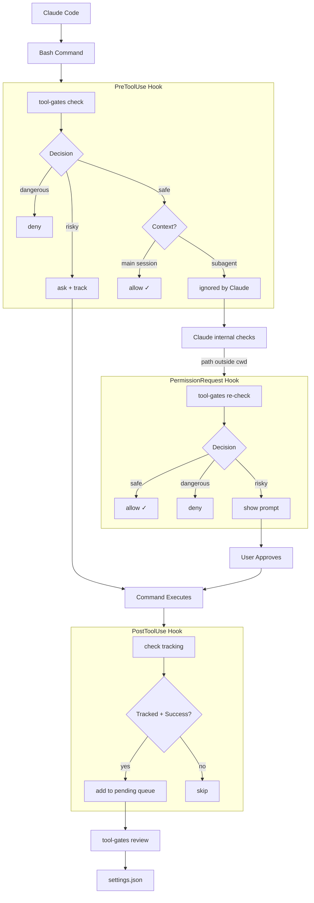

<div align="center">

# Tool Gates

*formerly `bash-gates`*

**Intelligent tool permission gate for AI coding assistants**

[](https://github.com/camjac251/tool-gates/actions/workflows/ci.yml)
[](https://github.com/camjac251/tool-gates/actions/workflows/release.yml)
[](https://www.rust-lang.org/)
[](LICENSE)

A Claude Code [PreToolUse hook](https://code.claude.com/docs/en/hooks#pretooluse) that analyzes bash commands using AST parsing and determines whether to allow, ask, or block based on potential impact.

[Installation](#installation) · [Permission Gates](#permission-gates) · [Security](#security-features) · [Testing](#testing)

</div>

---

## Features

| Feature                  | Description                                                                                            |
| ------------------------ | ------------------------------------------------------------------------------------------------------ |
| **Approval Learning**    | Tracks approved commands and saves patterns to settings.json via TUI or CLI                            |
| **Settings Integration** | Respects your `settings.json` allow/deny/ask rules - won't bypass your explicit permissions            |
| **Accept Edits Mode**    | Auto-allows file-editing commands (`sd`, `prettier --write`, etc.) when in acceptEdits mode            |
| **Modern CLI Hints**     | Suggests modern alternatives (`bat`, `rg`, `fd`, etc.) via `additionalContext` for Claude to learn     |
| **AST Parsing**          | Uses [tree-sitter-bash](https://github.com/tree-sitter/tree-sitter-bash) for accurate command analysis |
| **Compound Commands**    | Handles `&&`, `\|\|`, `\|`, `;` chains correctly                                                       |
| **Security First**       | Catches pipe-to-shell, eval, command injection patterns                                                |
| **Unknown Protection**   | Unrecognized commands require approval                                                                 |
| **Claude Code Plugin**   | Install as a plugin with the `/tool-gates:review` skill for interactive approval management            |
| **300+ Commands**        | 13 specialized gates with comprehensive coverage                                                       |
| **Fast**                 | Static native binary, no interpreter overhead                                                          |

---

## How It Works



**Why three hooks?**

- **PreToolUse**: Gates commands for main session, tracks "ask" decisions
- **PermissionRequest**: Gates commands for subagents (where PreToolUse's `allow` is ignored)
- **PostToolUse**: Detects successful execution, queues for permanent approval

> `PermissionRequest` metadata like `blocked_path` and `decision_reason` is optional in Claude Code payloads. tool-gates treats those fields as best-effort context, not required inputs.

**Decision Priority:** `BLOCK > ASK > ALLOW > SKIP`

| Decision  | Effect                      |
| :-------: | --------------------------- |
| **deny**  | Command blocked with reason |
|  **ask**  | User prompted for approval  |
| **allow** | Auto-approved               |

> Unknown commands always require approval.

### Settings.json Integration

tool-gates reads your Claude Code settings from `~/.claude/settings.json` and `.claude/settings.json` (project) to respect your explicit permission rules:

| settings.json | tool-gates | Result                                       |
| ------------- | ---------- | -------------------------------------------- |
| `deny` rule   | (any)      | Defers to Claude Code (respects your deny)   |
| `ask` rule    | (any)      | Defers to Claude Code (respects your ask)    |
| `allow` rule  | dangerous  | **deny** (tool-gates still blocks dangerous) |
| `allow`/none  | safe       | **allow**                                    |
| none          | unknown    | **ask**                                      |

This ensures tool-gates won't accidentally bypass your explicit deny rules while still providing security against dangerous commands.

**Settings file priority** (highest wins):

| Priority    | Location                                 | Description                   |
| ----------- | ---------------------------------------- | ----------------------------- |
| 1 (highest) | `/etc/claude-code/managed-settings.json` | Enterprise managed            |
| 2           | `.claude/settings.local.json`            | Local project (not committed) |
| 3           | `.claude/settings.json`                  | Shared project (committed)    |
| 4 (lowest)  | `~/.claude/settings.json`                | User settings                 |

### Accept Edits Mode

When Claude Code is in `acceptEdits` mode, tool-gates auto-allows file-editing commands:

```bash
# In acceptEdits mode - auto-allowed
sd 'old' 'new' file.txt           # Text replacement
prettier --write src/             # Code formatting
ast-grep -p 'old' -r 'new' -U .   # Code refactoring
sed -i 's/foo/bar/g' file.txt     # In-place sed
black src/                        # Python formatting
eslint --fix src/                 # Linting with fix
```

**Still requires approval (even in acceptEdits):**

- Package managers: `npm install`, `cargo add`
- Git operations: `git push`, `git commit`
- Deletions: `rm`, `mv`
- Blocked commands: `rm -rf /` still denied

### Modern CLI Hints

_Requires Claude Code 1.0.20+_

When Claude uses legacy commands, tool-gates suggests modern alternatives via `additionalContext`. This helps Claude learn better patterns over time without modifying the command.

```bash
# Claude runs: cat README.md
# tool-gates returns:
{
  "hookSpecificOutput": {
    "permissionDecision": "allow",
    "additionalContext": "Tip: Use 'bat README.md' for syntax highlighting and line numbers (Markdown rendering)"
  }
}
```

| Legacy Command                | Modern Alternative | When triggered                       |
| ----------------------------- | ------------------ | ------------------------------------ |
| `cat`, `head`, `tail`, `less` | `bat`              | Always (`tail -f` excluded)          |
| `grep` (code patterns)        | `sg`               | AST-aware code search                |
| `grep` (text/log/config)      | `rg`               | Any grep usage                       |
| `find`                        | `fd`               | Always                               |
| `ls`                          | `eza`              | With `-l` or `-a` flags              |
| `sed`                         | `sd`               | Substitution patterns (`s/.../.../`) |
| `awk`                         | `choose`           | Field extraction (`print $`)         |
| `du`                          | `dust`             | Always                               |
| `ps`                          | `procs`            | With `aux`, `-e`, `-A` flags         |
| `curl`, `wget`                | `xh`               | JSON APIs or verbose mode            |
| `diff`                        | `delta`            | Two-file comparisons                 |
| `xxd`, `hexdump`              | `hexyl`            | Always                               |
| `cloc`                        | `tokei`            | Always                               |
| `tree`                        | `eza -T`           | Always                               |
| `man`                         | `tldr`             | Always                               |
| `wc -l`                       | `rg -c`            | Line counting                        |

**Only suggests installed tools.** Hints are cached (7-day TTL) to avoid repeated `which` calls.

```bash
# Refresh tool detection cache
tool-gates --refresh-tools

# Check which tools are detected
tool-gates --tools-status
```

### Approval Learning

When you approve commands (via Claude Code's permission prompt), tool-gates tracks them and lets you permanently save patterns to settings.json.

```bash
# After approving some commands, review pending approvals
tool-gates pending list

# Interactive TUI dashboard
tool-gates review          # current project only
tool-gates review --all    # all projects

# Or approve directly via CLI
tool-gates approve 'npm install*' -s local
tool-gates approve 'cargo*' -s user

# Manage existing rules
tool-gates rules list
tool-gates rules remove 'pattern' -s local
```

**Scopes:**
| Scope | File | Use case |
|-------|------|----------|
| `local` | `.claude/settings.local.json` | Personal project overrides (not committed) |
| `user` | `~/.claude/settings.json` | Global personal use |
| `project` | `.claude/settings.json` | Share with team |

**Review TUI** (`tool-gates review`):

Three-panel dashboard -- project sidebar, command list, and detail panel.

- **Sidebar**: Lists projects with pending counts, auto-selects current project. Click or arrow to switch.
- **Command list**: Full commands with color-coded segments (green=allowed, yellow=ask, red=blocked). Multi-select with Space for batch operations.
- **Detail panel**: Shows segment breakdown, pattern (cycle with Left/Right), scope (cycle with Left/Right), and action buttons.

Compound commands (`&&`, `||`, `|`) show per-segment patterns so you can approve individual parts.

| Key | Action |
| --- | ------ |
| `Tab` | Cycle panel focus (Sidebar -> Commands -> Detail) |
| `Up`/`Down` or `j`/`k` | Navigate within focused panel |
| `Left`/`Right` or `h`/`l` | Cycle pattern or scope (in detail panel) |
| `Space` | Toggle multi-select on command |
| `Enter` | Approve selected command(s) |
| `d` | Skip (remove from pending) |
| `D` | Deny (add to settings.json deny list) |
| `q` or `Esc` | Quit |

---

## Installation

### Download Binary

```bash
# Linux x64
curl -Lo ~/.local/bin/tool-gates \
  https://github.com/camjac251/tool-gates/releases/latest/download/tool-gates-linux-amd64
chmod +x ~/.local/bin/tool-gates

# Linux ARM64
curl -Lo ~/.local/bin/tool-gates \
  https://github.com/camjac251/tool-gates/releases/latest/download/tool-gates-linux-arm64
chmod +x ~/.local/bin/tool-gates

# macOS Apple Silicon
curl -Lo ~/.local/bin/tool-gates \
  https://github.com/camjac251/tool-gates/releases/latest/download/tool-gates-darwin-arm64
chmod +x ~/.local/bin/tool-gates

# macOS Intel
curl -Lo ~/.local/bin/tool-gates \
  https://github.com/camjac251/tool-gates/releases/latest/download/tool-gates-darwin-amd64
chmod +x ~/.local/bin/tool-gates
```

### Build from Source

```bash
# Requires Rust 1.85+
cargo build --release
# Binary: ./target/x86_64-unknown-linux-musl/release/tool-gates
```

### Configure Claude Code

Use the `hooks` subcommand to configure Claude Code:

```bash
# Install to user settings (recommended)
tool-gates hooks add -s user

# Install to project settings (shared with team)
tool-gates hooks add -s project

# Install to local project settings (not committed)
tool-gates hooks add -s local

# Preview changes without writing
tool-gates hooks add -s user --dry-run

# Check installation status
tool-gates hooks status

# Output hooks JSON for manual config
tool-gates hooks json
```

**Scopes:**
| Scope | File | Use case |
|-------|------|----------|
| `user` | `~/.claude/settings.json` | Personal use (recommended) |
| `project` | `.claude/settings.json` | Share with team |
| `local` | `.claude/settings.local.json` | Personal project overrides |

**All three hooks are installed:**

- `PreToolUse` - Gates commands for main session, tracks "ask" decisions
- `PermissionRequest` - Gates commands for subagents (where PreToolUse's allow is ignored)
- `PostToolUse` - Detects successful execution, queues for permanent approval

<details>
<summary>Manual installation</summary>

Add to `~/.claude/settings.json`:

```json
{
  "hooks": {
    "PreToolUse": [
      {
        "matcher": "Bash",
        "hooks": [
          {
            "type": "command",
            "command": "~/.local/bin/tool-gates",
            "timeout": 10
          }
        ]
      }
    ],
    "PermissionRequest": [
      {
        "matcher": "Bash",
        "hooks": [
          {
            "type": "command",
            "command": "~/.local/bin/tool-gates",
            "timeout": 10
          }
        ]
      }
    ],
    "PostToolUse": [
      {
        "matcher": "Bash",
        "hooks": [
          {
            "type": "command",
            "command": "~/.local/bin/tool-gates",
            "timeout": 10
          }
        ]
      }
    ]
  }
}
```

</details>

### Claude Code Plugin (Optional)

tool-gates ships as a [Claude Code plugin](https://code.claude.com/docs/en/plugins) with the `/tool-gates:review` skill for interactive approval management. The plugin provides the skill only -- hook installation is handled by the binary (see [Configure Claude Code](#configure-claude-code) above).

**Prerequisites:** The `tool-gates` binary must be installed and hooks configured before using the plugin.

**Install from marketplace:**

```bash
# In Claude Code, add the marketplace
/plugin marketplace add camjac251/tool-gates

# Install the plugin
/plugin install tool-gates@camjac251-tool-gates
```

**Install from local clone:**

```bash
# Launch Claude Code with the plugin loaded
claude --plugin-dir /path/to/tool-gates
```

**Using the review skill:**

```bash
# Review all pending approvals
/tool-gates:review

# Review only current project
/tool-gates:review --project
```

The skill lists commands you've been manually approving, shows counts and suggested patterns, and lets you multi-select which to make permanent at your chosen scope (local, project, or user).

| Step                   | What happens                                | Permission                 |
| ---------------------- | ------------------------------------------- | -------------------------- |
| List pending approvals | `tool-gates pending list`                   | Auto-approved (read-only)  |
| Show current rules     | `tool-gates rules list`                     | Auto-approved (read-only)  |
| Approve a pattern      | `tool-gates approve '<pattern>' -s <scope>` | Requires your confirmation |

---

## Permission Gates

### Tool Gates (Self)

tool-gates recognizes its own CLI commands:

| Allow                                                                                                                   | Ask                                                                                  |
| ----------------------------------------------------------------------------------------------------------------------- | ------------------------------------------------------------------------------------ |
| `pending list`, `pending count`, `rules list`, `hooks status`, `--help`, `--version`, `--tools-status`, `--export-toml` | `approve`, `rules remove`, `pending clear`, `hooks add`, `review`, `--refresh-tools` |

### Basics

~130+ safe read-only commands: `echo`, `cat`, `ls`, `grep`, `rg`, `awk`, `sed` (no -i), `ps`, `whoami`, `date`, `jq`, `yq`, `bat`, `fd`, `tokei`, `hexdump`, and more. Custom handlers for `xargs` (safe only with known-safe targets) and `bash -c`/`sh -c` (parses inner script).

### Beads Issue Tracker

[Beads](https://github.com/steveyegge/beads) - Git-native issue tracking

| Allow                                                                                | Ask                                                                              |
| ------------------------------------------------------------------------------------ | -------------------------------------------------------------------------------- |
| `list`, `show`, `ready`, `blocked`, `search`, `stats`, `doctor`, `dep tree`, `prime` | `create`, `update`, `close`, `delete`, `sync`, `init`, `dep add`, `comments add` |

### MCP CLI

`mcp-cli` - Claude Code's [experimental token-efficient MCP interface](https://github.com/anthropics/claude-code/issues/12836#issuecomment-3629052941)

Instead of loading full MCP tool definitions into the system prompt, Claude discovers tools on-demand via `mcp-cli` and executes them through Bash. Enable with `ENABLE_EXPERIMENTAL_MCP_CLI=true`.

| Allow                                                           | Ask                        |
| --------------------------------------------------------------- | -------------------------- |
| `servers`, `tools`, `info`, `grep`, `resources`, `read`, `help` | `call` (invokes MCP tools) |

Pre-approve trusted servers in settings.json to avoid repeated prompts:

```json
{
  "permissions": {
    "allow": ["mcp__perplexity", "mcp__context7__*"],
    "deny": ["mcp__firecrawl__firecrawl_crawl"]
  }
}
```

Patterns: `mcp__<server>` (entire server), `mcp__<server>__<tool>` (specific tool), `mcp__<server>__*` (wildcard)

### GitHub CLI

| Allow                                                       | Ask                                                  | Block                        |
| ----------------------------------------------------------- | ---------------------------------------------------- | ---------------------------- |
| `pr list`, `issue view`, `repo view`, `search`, `api` (GET) | `pr create`, `pr merge`, `issue create`, `repo fork` | `repo delete`, `auth logout` |

### Git

| Allow                                        | Ask                                      | Ask (warning)                               |
| -------------------------------------------- | ---------------------------------------- | ------------------------------------------- |
| `status`, `log`, `diff`, `show`, `branch -a` | `add`, `commit`, `push`, `pull`, `merge` | `push --force`, `reset --hard`, `clean -fd` |

### Shortcut CLI

[shortcut-cli](https://github.com/shortcut-cli/shortcut-cli) - Community CLI for Shortcut

| Allow                                                                                 | Ask                                                                                        |
| ------------------------------------------------------------------------------------- | ------------------------------------------------------------------------------------------ |
| `search`, `find`, `story` (view), `members`, `epics`, `workflows`, `projects`, `help` | `create`, `install`, `story` (with update flags), `search --save`, `api` (POST/PUT/DELETE) |

### Cloud CLIs

AWS, gcloud, terraform, kubectl, docker, podman, az, helm, pulumi

| Allow                                         | Ask                                        | Block                                      |
| --------------------------------------------- | ------------------------------------------ | ------------------------------------------ |
| `describe-*`, `list-*`, `get`, `show`, `plan` | `create`, `delete`, `apply`, `run`, `exec` | `iam delete-user`, `delete ns kube-system` |

### Network

| Allow                         | Ask                                    | Block                   |
| ----------------------------- | -------------------------------------- | ----------------------- |
| `curl` (GET), `wget --spider` | `curl -X POST`, `wget`, `ssh`, `rsync` | `nc -e` (reverse shell) |

### Filesystem

| Allow                 | Ask                                 | Block                  |
| --------------------- | ----------------------------------- | ---------------------- |
| `tar -tf`, `unzip -l` | `rm`, `mv`, `cp`, `chmod`, `sed -i` | `rm -rf /`, `rm -rf ~` |

### Developer Tools

~50+ tools with write-flag detection: `jq`, `shellcheck`, `hadolint`, `vite`, `vitest`, `jest`, `tsc`, `esbuild`, `turbo`, `nx`

| Safe by default                                                                                                         | Ask with flags                                          |
| ----------------------------------------------------------------------------------------------------------------------- | ------------------------------------------------------- |
| `ast-grep`, `yq`, `semgrep`, `sad`, `prettier`, `eslint`, `biome`, `ruff`, `black`, `gofmt`, `rustfmt`, `golangci-lint` | `-U`, `-i`, `--fix`, `--write`, `--commit`, `--autofix` |
| `sd` (pipe mode safe, ask with file args), always ask: `watchexec` (runs commands), `dos2unix`                          |                                                         |

### Package Managers

npm, pnpm, yarn, pip, uv, cargo, go, bun, conda, poetry, pipx, mise

| Allow                                  | Ask                                          |
| -------------------------------------- | -------------------------------------------- |
| `list`, `show`, `test`, `build`, `dev` | `install`, `add`, `remove`, `publish`, `run` |

### System

**Database CLIs:** psql, mysql, sqlite3, mongosh, redis-cli
**Build tools:** make, cmake, ninja, just, gradle, maven, bazel
**OS Package managers:** apt, brew, pacman, nix, dnf, zypper, flatpak, snap
**Other:** sudo, systemctl, crontab, kill

| Allow                                           | Ask                               | Block                                                             |
| ----------------------------------------------- | --------------------------------- | ----------------------------------------------------------------- |
| `psql -l`, `make test`, `sudo -l`, `apt search` | `make deploy`, `sudo apt install` | `shutdown`, `reboot`, `mkfs`, `dd`, `fdisk`, `iptables`, `passwd` |

---

## Security Features

### Pre-AST Security Checks

Comments are stripped before checking (quote-aware, respects bash word-boundary rules for `#`) so patterns inside comments don't trigger false positives.

```bash
curl https://example.com | bash     # ask - pipe to shell
eval "rm -rf /"                     # ask - arbitrary execution
source ~/.bashrc                    # ask - sourcing script
echo $(rm -rf /tmp/*)               # ask - dangerous substitution
find . | xargs rm                   # ask - xargs to rm
echo "data" > /etc/passwd           # ask - output redirection
```

### Compound Command Handling

Strictest decision wins:

```bash
git status && rm -rf /     # deny  (rm -rf / blocked)
git status && npm install  # ask   (npm install needs approval)
git status && git log      # allow (both read-only)
```

### Smart sudo Handling

```bash
sudo apt install vim          # ask - "sudo: Installing packages (apt)"
sudo systemctl restart nginx  # ask - "sudo: systemctl restart"
```

---

## Testing

```bash
cargo test                        # Full suite
cargo test gates::git             # Specific gate
cargo test -- --nocapture         # With output
```

### Manual Testing

```bash
# Allow
echo '{"tool_name":"Bash","tool_input":{"command":"git status"}}' | tool-gates
# -> {"hookSpecificOutput":{"permissionDecision":"allow"}}

# Ask
echo '{"tool_name":"Bash","tool_input":{"command":"npm install"}}' | tool-gates
# -> {"hookSpecificOutput":{"permissionDecision":"ask","permissionDecisionReason":"npm: Installing packages"}}

# Deny
echo '{"tool_name":"Bash","tool_input":{"command":"rm -rf /"}}' | tool-gates
# -> {"hookSpecificOutput":{"permissionDecision":"deny"}}
```

---

## Architecture

```
src/
├── main.rs              # Entry point, CLI commands
├── models.rs            # Types (HookInput, HookOutput, Decision)
├── parser.rs            # tree-sitter-bash AST parsing
├── router.rs            # Security checks + gate routing
├── settings.rs          # settings.json parsing and pattern matching
├── hints.rs             # Modern CLI hints (cat→bat, grep→rg, etc.)
├── tool_cache.rs        # Tool availability cache for hints
├── mise.rs              # Mise task file parsing and command extraction
├── package_json.rs      # package.json script parsing and command extraction
├── tracking.rs          # PreToolUse→PostToolUse correlation (15min TTL)
├── pending.rs           # Pending approval queue (JSONL format)
├── patterns.rs          # Pattern suggestion algorithm
├── post_tool_use.rs     # PostToolUse handler
├── permission_request.rs # PermissionRequest hook handler
├── settings_writer.rs   # Write rules to Claude settings files
├── toml_export.rs       # TOML policy export for Gemini CLI
├── generated/           # Auto-generated by build.rs (DO NOT EDIT)
│   ├── rules.rs         # Rust gate functions from rules/*.toml
│   └── toml_policy.rs   # Gemini CLI TOML policy string
├── tui/                 # Interactive review TUI (three-panel dashboard)
└── gates/               # 13 specialized permission gates
    ├── mod.rs           # Gate registry (ordered by priority)
    ├── helpers.rs       # Common gate helper functions
    ├── tool_gates.rs    # tool-gates CLI itself
    ├── basics.rs        # Safe commands (~130+)
    ├── beads.rs         # Beads issue tracker (bd) - github.com/steveyegge/beads
    ├── mcp.rs           # MCP CLI (mcp-cli) - Model Context Protocol
    ├── gh.rs            # GitHub CLI
    ├── git.rs           # Git
    ├── shortcut.rs      # Shortcut CLI (short) - github.com/shortcut-cli/shortcut-cli
    ├── cloud.rs         # AWS, gcloud, terraform, kubectl, docker, podman, az, helm, pulumi
    ├── network.rs       # curl, wget, ssh, rsync, netcat, HTTPie
    ├── filesystem.rs    # rm, mv, cp, chmod, tar, zip
    ├── devtools.rs      # sd, ast-grep, yq, semgrep, biome, prettier, eslint, ruff, black
    ├── package_managers.rs  # npm, pnpm, yarn, pip, uv, cargo, go, bun, conda, poetry, pipx, mise
    └── system.rs        # psql, mysql, make, sudo, systemctl, OS pkg managers, build tools
```

---

## Gemini CLI Integration

Gemini CLI's hook system cannot prompt users (only allow/block). Use the policy engine instead:

```bash
tool-gates --export-toml > ~/.gemini/policies/tool-gates.toml
```

This exports 700+ policy rules derived from the gate definitions:

| Priority | Action     | Examples                              |
| -------- | ---------- | ------------------------------------- |
| 900+     | `deny`     | `rm -rf /`, `gh repo delete`          |
| 200-299  | `ask_user` | `npm install`, `git push`             |
| 100-199  | `allow`    | `git status`, `ls`, `cat`             |
| 1        | `ask_user` | Default fallback for unknown commands |

---

## Links

- [Claude Code Hooks Documentation](https://code.claude.com/docs/en/hooks)
- [Claude Code MCP-CLI (experimental)](https://github.com/anthropics/claude-code/issues/12836#issuecomment-3629052941)
- [tree-sitter-bash](https://github.com/tree-sitter/tree-sitter-bash)
- [Beads Issue Tracker](https://github.com/steveyegge/beads)
- [Shortcut CLI](https://github.com/shortcut-cli/shortcut-cli)
