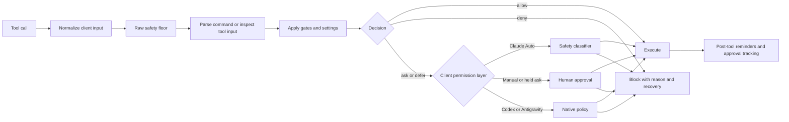

<div align="center">

# Tool Gates

<p><strong>Deterministic guardrails for autonomous coding agents</strong></p>

[](https://camjac251.github.io/tool-gates/) [](https://github.com/camjac251/tool-gates/actions/workflows/ci.yml) [](https://github.com/camjac251/tool-gates/actions/workflows/release.yml) [](https://www.rust-lang.org/) [](https://spdx.org/licenses/MIT.html)

Tool Gates evaluates shell commands, file operations, and tool calls before they run. It combines tree-sitter parsing with a non-configurable safety floor and per-tool policy, then returns the narrowest safe decision for the active client.

[**Read the documentation →**](https://camjac251.github.io/tool-gates/)

[Why Tool Gates?](#why-tool-gates) · [Quick start](#quick-start) · [How it works](#how-it-works) · [Clients](#client-support) · [Configuration](#configuration)

</div>

> [!IMPORTANT] **Claude Code Auto Mode changes the job of a permission hook.** New Claude Code sessions on Pro, Max, and Team plans use Auto Mode by default unless a different default is already pinned. **Auto Mode does not bypass Tool Gates.** Tool Gates still evaluates each supported hook call before Claude's classifier: known-safe calls can run, hard-denied calls remain blocked, and selected irreversible actions can still require a human. See [Tool Gates and Auto Mode](#tool-gates-and-auto-mode) and [Anthropic's rollout announcement](https://claude.com/blog/auto-mode-default-in-claude-code).

## Why Tool Gates?

Native permission systems have different wire formats, defaults, and ideas of what counts as safe. Tool Gates puts one predictable policy layer in front of them.

| Without a shared gate | With Tool Gates |
| --- | --- |
| Repeated prompts encourage broad, permanent allow rules | Known-safe operations can be approved precisely |
| Text matching misses shell structure inside chains and pipelines | Commands are parsed as syntax with `tree-sitter-bash` |
| A probabilistic classifier makes every borderline decision | Deterministic denials and explicit human holds run first |
| Client behavior drifts across Claude, Codex, and Antigravity | One gate engine renders a client-native result |
| An approval disappears after the session | Successful human approvals can be reviewed and saved intentionally |

Tool Gates is a guardrail layer, not a sandbox or a replacement for code review. Its purpose is to reduce needless friction while keeping deterministic policy in the loop as agents become more autonomous.

## Quick start

Install with Homebrew on macOS or Linux:

```bash
brew install camjac251/tap/tool-gates
```

Add the Claude Code hooks and verify the installation:

```bash
tool-gates hooks add -s user
tool-gates doctor
```

For binaries, Cargo installation, and upgrades, see the [installation guide](https://camjac251.github.io/tool-gates/install.html).

<details>
<summary><strong>Codex CLI setup</strong></summary>

```bash
tool-gates hooks add --codex
tool-gates doctor
```

</details>

<details>
<summary><strong>Antigravity CLI setup</strong></summary>

```bash
# User hooks: ~/.gemini/config/hooks.json
tool-gates hooks add --antigravity

# Optional project hooks: .agents/hooks.json
tool-gates hooks add --antigravity -s project

# Add native allow rules for recognized read-only commands
tool-gates agy allowlist --apply

tool-gates doctor
```

</details>

<details>
<summary><strong>Gemini CLI compatibility setup</strong></summary>

Gemini CLI support is deprecated and retained only for existing installations. New Google client integrations should target Antigravity.

```bash
tool-gates hooks add --gemini
tool-gates doctor
```

</details>

## How it works

Every supported client is normalized into the same gate pipeline. Raw-command checks run before AST parsing, configured rules are merged with the deterministic safety floor, and only then is the result translated into the client's native hook format.


```mermaid
flowchart LR
    CALL[Tool call] --> NORMALIZE[Normalize client input]
    NORMALIZE --> FLOOR[Raw safety floor]
    FLOOR --> PARSE[Parse command or inspect tool input]
    PARSE --> GATES[Apply gates and settings]
    GATES --> DECISION{Decision}

    DECISION -->|allow| RUN[Execute]
    DECISION -->|deny| STOP[Block with reason and recovery]
    DECISION -->|ask or defer| CLIENT{Client permission layer}

    CLIENT -->|Claude Auto| CLASSIFIER[Safety classifier]
    CLIENT -->|Manual or held ask| HUMAN[Human approval]
    CLIENT -->|Codex or Antigravity| NATIVE[Native policy]

    CLASSIFIER --> RUN
    CLASSIFIER --> STOP
    HUMAN --> RUN
    HUMAN --> STOP
    NATIVE --> RUN
    NATIVE --> STOP

    RUN --> POST[Post-tool reminders and approval tracking]
```

| Engine outcome | Meaning | What happens next |
| --- | --- | --- |
| **Allow** | The operation matches known-safe policy | It runs immediately where the client honors hook allows |
| **Ask / defer** | The operation is mutating, unknown, or needs another decision | The user, Claude's Auto classifier, or the client's native policy decides |
| **Deny** | The safety floor or an explicit block rule rejected the operation | Execution stops with a specific reason and, when available, a safer recovery action |

Read the [architecture](https://camjac251.github.io/tool-gates/architecture.html) and [hook model](https://camjac251.github.io/tool-gates/hook-model.html) for the full precedence and serialization contracts.

## Tool Gates and Auto Mode

Auto Mode replaces many human approval prompts with a separate safety classifier. It does not make deterministic hooks redundant; it changes which layer resolves an undecided call.

| Tool Gates result in Claude Auto Mode | Result |
| --- | --- |
| Known-safe **allow** | Runs without classifier review |
| Ordinary gate **ask** | Becomes a defer so the classifier can allow or deny it |
| Explicit `auto = "prompt"` rule | Remains a human approval; non-interactive sessions fail closed |
| Hard **deny** | Remains denied; the classifier does not get a vote |
| Classifier denial of a gate-safe command | Can produce a retry hint with a narrower, safer alternative |

Tool Gates also promotes high-risk shell asks such as pipe-to-shell and `eval` to denials in Auto Mode, and it does not record silent classifier approvals as prior human consent. See the complete [Auto Mode guide](https://camjac251.github.io/tool-gates/auto-mode.html), including rollout, opt-out, `classifyAllShell`, and settings-precedence details.

## Features

| Capability | What it provides |
| --- | --- |
| **Shell-aware gates** | Correct handling of pipelines, substitutions, wrappers, and `&&`, ` |  | `, `;` command chains |
| **Security floor** | Non-configurable blocks and asks for command injection, pipe-to-shell, `eval`, unsafe output caps, and other high-impact forms |
| **File guards** | Symlink and sensitive-path protection for agent instruction and configuration files |
| **Security reminders** | Write/Edit scans for 28 security anti-patterns across three severity tiers |
| **Design and comment lint** | Opt-in reminders for templated UI patterns, missing interaction basics, and low-value code comments |
| **Approval learning** | A review queue that turns successful human approvals into deliberate reusable rules |
| **CLI guidance** | Contextual recovery actions and modern command alternatives such as `bat`, `rg`, and `fd` |
| **Mode awareness** | Separate behavior for manual/default, `acceptEdits`, Auto, plan, and bypass modes |

Explore the [gate reference](https://camjac251.github.io/tool-gates/gates/), [security floor](https://camjac251.github.io/tool-gates/security-floor.html), [security reminders](https://camjac251.github.io/tool-gates/security-reminders.html), and [design lint](https://camjac251.github.io/tool-gates/design-lint.html).

## Client support

| Client | Integration behavior | Setup |
| --- | --- | --- |
| [Claude Code](https://code.claude.com/docs/en/hooks) | Full mode-aware hook lifecycle, including Auto classifier routing, permission-denial recovery, and approval tracking | `tool-gates hooks add -s user` |
| [Codex CLI](https://github.com/openai/codex) | Pre-execution output is deny-only; non-denies stay silent so Codex can apply its own `approval_policy` | `tool-gates hooks add --codex` |
| [Antigravity CLI](https://antigravity.google/docs/hooks) | Hook decisions only tighten native policy; use the generated native allowlist for prompt-free recognized reads | `tool-gates hooks add --antigravity` |
| [Gemini CLI](https://github.com/google-gemini/gemini-cli) | Deprecated compatibility for existing setups | `tool-gates hooks add --gemini` |

Client behavior is intentionally not flattened into a false common denominator. The shared engine keeps one policy, while each serializer emits only decisions that its client can honor safely.

## Configuration

User configuration lives at `~/.config/tool-gates/config.toml`. Project and client settings participate in a documented precedence model, while the hard safety floor remains non-configurable.

Common configuration areas include:

- enabling or disabling individual gates, hints, and optional content scans;
- adding explicit allow, ask, deny, or Auto-specific prompt rules;
- resolving Git aliases before gate evaluation;
- blocking selected tools or restricting their domains;
- auto-approving trusted skills under scoped paths and project conditions; and
- allowing Codex patch applications inside the project directory.

Start with the [configuration reference](https://camjac251.github.io/tool-gates/configuration.html), then review [permission modes](https://camjac251.github.io/tool-gates/modes.html) and [settings precedence](https://camjac251.github.io/tool-gates/settings-precedence.html).

## Approval learning and diagnostics

Tool Gates records successful prompt-backed decisions for later review. Nothing is learned permanently until you select and save it.

```bash
# Review pending human approvals in the TUI
tool-gates review

# Inspect stored rules
tool-gates rules list

# Check binaries, hooks, and configuration health
tool-gates doctor
```

See the [CLI reference](https://camjac251.github.io/tool-gates/cli.html) and [approval learning guide](https://camjac251.github.io/tool-gates/approval-learning.html).

## Acknowledgements

Security reminder patterns were built on and informed by:

- [Anthropic's security-guidance plugin](https://github.com/anthropics/claude-plugins-official/tree/main/plugins/security-guidance), the official Claude Code security hook whose base patterns were expanded here;
- [Arcanum-Sec/sec-context](https://github.com/Arcanum-Sec/sec-context), a curated security anti-pattern database synthesized from more than 150 sources;
- [SecureCodeWarrior/ai-security-rules](https://github.com/SecureCodeWarrior/ai-security-rules), security rule files for coding tools;
- the [OWASP Top 10](https://owasp.org/www-project-top-ten/), standard web application security risks;
- [dwarvesf/claude-guardrails](https://github.com/dwarvesf/claude-guardrails), multi-layer defense hooks for Claude Code; and
- GitHub's [workflow injection research](https://github.blog/security/vulnerability-research/how-to-catch-github-actions-workflow-injections-before-attackers-do/).

## Project links

- [Live documentation](https://camjac251.github.io/tool-gates/)
- [What's new](https://camjac251.github.io/tool-gates/whats-new.html)
- [Gate reference](https://camjac251.github.io/tool-gates/gates/)
- [Claude Code hooks](https://code.claude.com/docs/en/hooks)
- [Antigravity CLI hooks](https://antigravity.google/docs/hooks)
- [tree-sitter-bash](https://github.com/tree-sitter/tree-sitter-bash)
